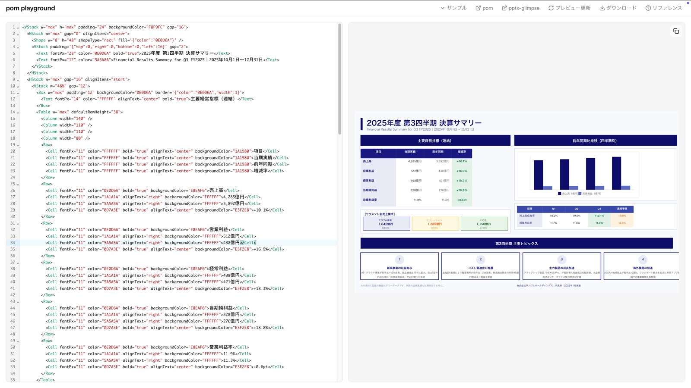

<h1 align="center">pom</h1>
<p align="center">
  AI-friendly PowerPoint generation with a Flexbox layout engine.
</p>

<p align="center">
  <a href="https://www.npmjs.com/package/@hirokisakabe/pom"></a>
  <a href="https://github.com/hirokisakabe/pom/blob/main/LICENSE"></a>
</p>

<p align="center">
  <b>pom (PowerPoint Object Model)</b> is a TypeScript library that converts XML into editable PowerPoint files (.pptx).
</p>

<p align="center">
  <a href="https://pom.pptx.app/playground"><b>Try it online — Playground</b></a>
</p>

<p align="center">
  <a href="https://pom.pptx.app/playground">
    
  </a>
</p>

---

## Features

- **AI Friendly** — Simple XML structure designed for LLM code generation.
- **Declarative** — Describe slides as XML. No imperative API calls needed.
- **Flexible Layout** — Flexbox-style layout with VStack / HStack, powered by yoga-layout.
- **Rich Nodes** — 18 built-in node types: charts, flowcharts, tables, timelines, org trees, and more.
- **Schema-validated** — XML input is validated with Zod schemas at runtime with clear error messages.
- **PowerPoint Native** — Full access to native PowerPoint shape features (roundRect, ellipse, arrows, etc.).

## Quick Start

> Requires Node.js 18+

```bash
npm install @hirokisakabe/pom
```

```typescript
import { buildPptx } from "@hirokisakabe/pom";

const xml = `
<VStack w="100%" h="max" padding="48" gap="24" alignItems="start">
  <Text fontSize="48" bold="true">Presentation Title</Text>
  <Text fontSize="24" color="666666">Subtitle</Text>
</VStack>
`;

const { pptx } = await buildPptx(xml, { w: 1280, h: 720 });
await pptx.writeFile({ fileName: "presentation.pptx" });
```

## Packages

This repository is a pnpm monorepo containing the following packages:

| Package                                       | Description                                                  | npm                                                                                        |
| --------------------------------------------- | ------------------------------------------------------------ | ------------------------------------------------------------------------------------------ |
| [packages/pom](./packages/pom/)               | Core library — XML to PPTX conversion                        | [`@hirokisakabe/pom`](https://www.npmjs.com/package/@hirokisakabe/pom)                     |
| [packages/pom-md](./packages/pom-md/)         | Markdown to pom XML converter                                | [`@hirokisakabe/pom-md`](https://www.npmjs.com/package/@hirokisakabe/pom-md)               |
| [packages/pom-vscode](./packages/pom-vscode/) | VS Code extension for live preview                           | [Marketplace](https://marketplace.visualstudio.com/items?itemName=hirokisakabe.pom-vscode) |
| [apps/website](./apps/website/)               | Documentation website ([pom.pptx.app](https://pom.pptx.app)) | —                                                                                          |

## Documentation

| Document                                                    | Description                           |
| ----------------------------------------------------------- | ------------------------------------- |
| [API Reference](./packages/pom/docs/api-reference.md)       | `buildPptx()` function and options    |
| [Nodes](./packages/pom/docs/nodes.md)                       | Complete reference for all node types |
| [Master Slide](./packages/pom/docs/master-slide.md)         | Headers, footers, and page numbers    |
| [Text Measurement](./packages/pom/docs/text-measurement.md) | Text measurement options and settings |
| [llm.txt](https://pom.pptx.app/llm.txt)                     | Compact XML reference for LLM prompts |
| [Playground](https://pom.pptx.app/playground)               | Try pom XML in the browser            |

## License

MIT
