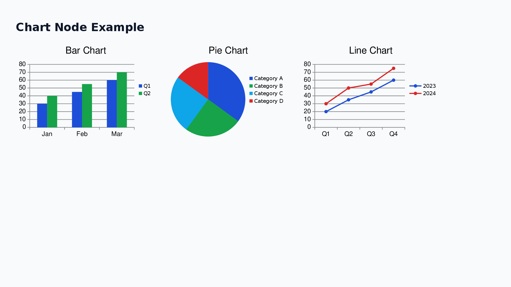
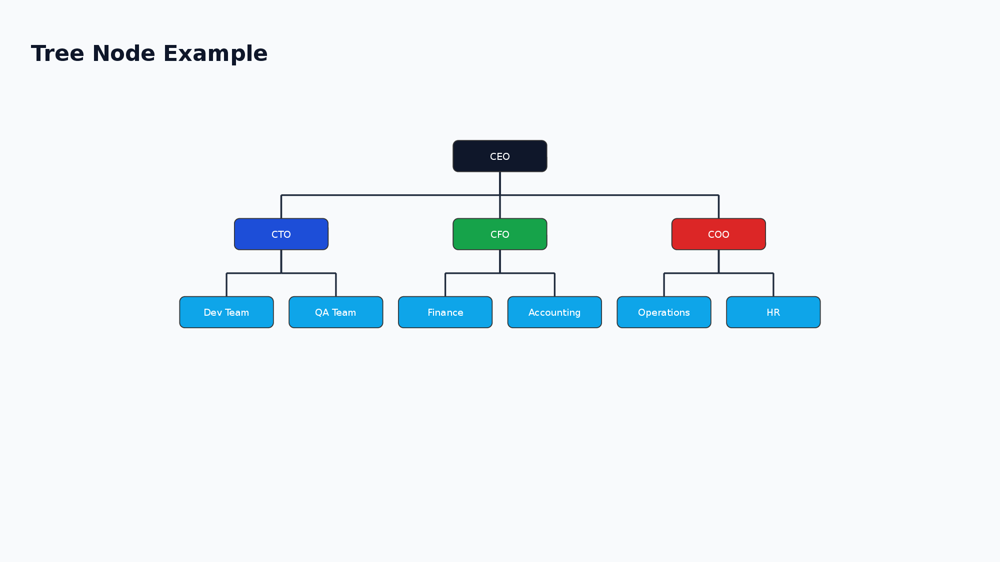
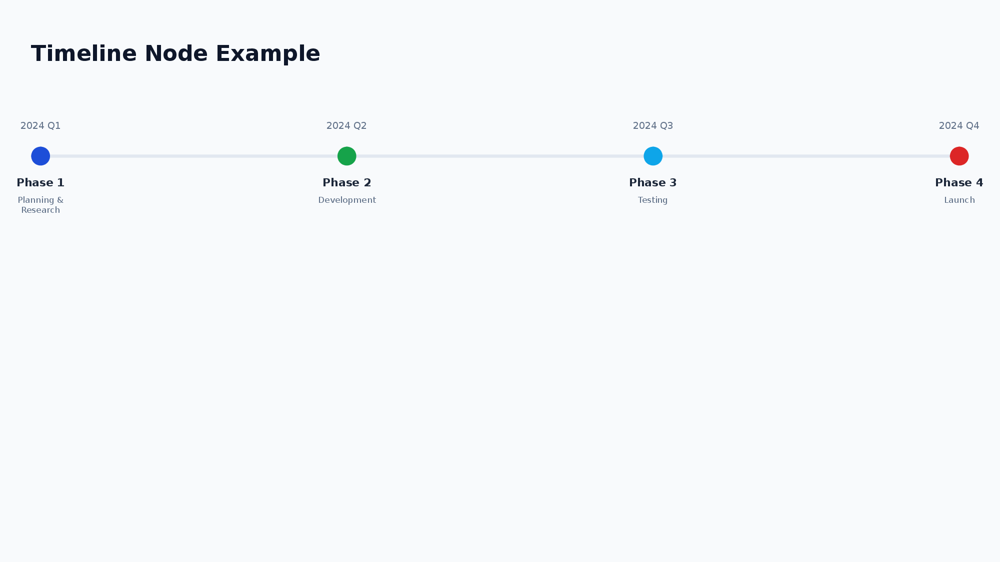
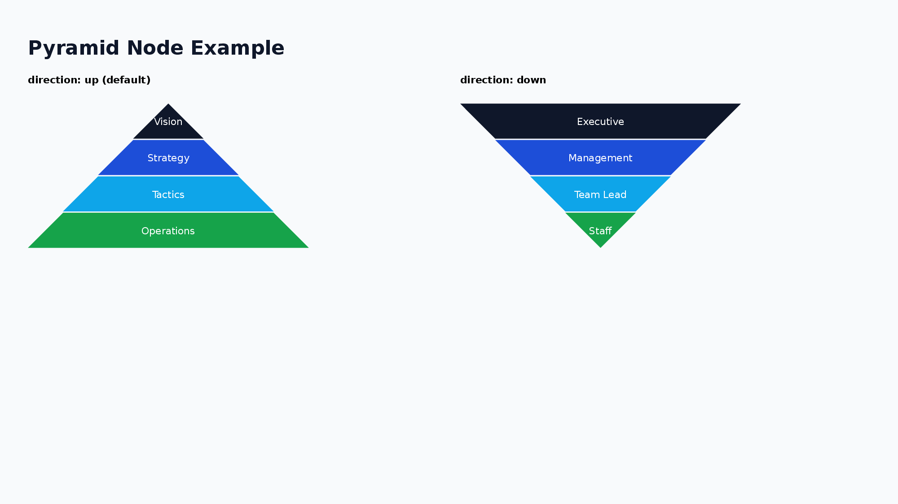

<h1 align="center">pom</h1>
<p align="center">
  AI-friendly PowerPoint generation with a Flexbox layout engine.
</p>

<p align="center">
  <a href="https://www.npmjs.com/package/@hirokisakabe/pom"></a>
  <a href="https://github.com/hirokisakabe/pom/blob/main/LICENSE"></a>
</p>

<p align="center">
  <b>pom (PowerPoint Object Model)</b> is a TypeScript library that converts XML into editable PowerPoint files (.pptx).
</p>

<p align="center">
  <a href="https://pom.pptx.app/playground"><b>Try it online — Playground</b></a>
</p>

<p align="center">
  <a href="https://pom.pptx.app/playground">
    
  </a>
</p>

---

## Table of Contents

- [Features](#features)
- [Quick Start](#quick-start)
- [Available Nodes](#available-nodes)
- [Node Examples](#node-examples)
- [Documentation](#documentation)
- [License](#license)

## Features

- **AI Friendly** — Simple XML structure designed for LLM code generation. Pair with [LLM Integration guide](./docs/llm-integration.md) for prompt-ready references.
- **Declarative** — Describe slides as XML. No imperative API calls needed.
- **Flexible Layout** — Flexbox-style layout with VStack / HStack / Box, powered by yoga-layout.
- **Rich Nodes** — 15 built-in node types: charts, flowcharts, tables, timelines, org trees, and more.
- **Schema-validated** — XML input is validated with Zod schemas at runtime with clear error messages.
- **PowerPoint Native** — Full access to native PowerPoint shape features (roundRect, ellipse, arrows, etc.).
- **Pixel Units** — Intuitive pixel-based sizing (internally converted to inches at 96 DPI).
- **Master Slide** — Define headers, footers, and page numbers once — applied to all slides automatically.
- **Accurate Text Measurement** — Text width measured with opentype.js and bundled Noto Sans JP fonts for consistent layout.

## Quick Start

> Requires Node.js 18+

```bash
npm install @hirokisakabe/pom
```

```typescript
import { buildPptx } from "@hirokisakabe/pom";

const xml = `
<VStack w="100%" h="max" padding="48" gap="24" alignItems="start">
  <Text fontSize="48" bold="true">Presentation Title</Text>
  <Text fontSize="24" color="666666">Subtitle</Text>
</VStack>
`;

const pptx = await buildPptx(xml, { w: 1280, h: 720 });
await pptx.writeFile({ fileName: "presentation.pptx" });
```

## Available Nodes

| Node         | Description                                    |
| ------------ | ---------------------------------------------- |
| Text         | Text with font styling and decoration          |
| Ul           | Unordered (bullet) list with Li items          |
| Ol           | Ordered (numbered) list with Li items          |
| Image        | Images from file path, URL, or base64          |
| Table        | Tables with customizable columns and rows      |
| Shape        | PowerPoint shapes (roundRect, ellipse, etc.)   |
| Chart        | Charts (bar, line, pie, area, doughnut, radar) |
| Timeline     | Timeline / roadmap visualizations              |
| Matrix       | 2x2 positioning maps                           |
| Tree         | Organization charts and decision trees         |
| Flow         | Flowcharts with nodes and edges                |
| ProcessArrow | Chevron-style process diagrams                 |
| Pyramid      | Pyramid diagrams for hierarchies               |
| Line         | Horizontal / vertical lines                    |
| Layer        | Absolute-positioned overlay container          |
| Box          | Container for single child with padding        |
| VStack       | Vertical stack layout                          |
| HStack       | Horizontal stack layout                        |

For detailed node documentation, see [Nodes](./docs/nodes.md).

## Node Examples

### Chart

```xml
<Chart chartType="bar" w="350" h="250" showTitle="true" title="Bar Chart" showLegend="true">
  <ChartSeries name="Q1">
    <ChartDataPoint label="Jan" value="30" />
    <ChartDataPoint label="Feb" value="45" />
  </ChartSeries>
</Chart>
```



### Flow

```xml
<Flow direction="horizontal" w="100%" h="300">
  <FlowNode id="start" shape="flowChartTerminator" text="Start" color="16A34A" />
  <FlowNode id="process" shape="flowChartProcess" text="Process" color="1D4ED8" />
  <FlowNode id="end" shape="flowChartTerminator" text="End" color="DC2626" />
  <FlowConnection from="start" to="process" />
  <FlowConnection from="process" to="end" />
</Flow>
```


### Tree

```xml
<Tree layout="vertical" nodeShape="roundRect" w="100%" h="400">
  <TreeItem label="CEO" color="0F172A">
    <TreeItem label="CTO" color="1D4ED8">
      <TreeItem label="Dev Team" color="0EA5E9" />
    </TreeItem>
    <TreeItem label="CFO" color="16A34A">
      <TreeItem label="Finance" color="0EA5E9" />
    </TreeItem>
  </TreeItem>
</Tree>
```



### Table

```xml
<Table defaultRowHeight="36">
  <TableColumn width="80" />
  <TableColumn width="200" />
  <TableRow>
    <TableCell bold="true" backgroundColor="0F172A" color="FFFFFF">ID</TableCell>
    <TableCell bold="true" backgroundColor="0F172A" color="FFFFFF">Name</TableCell>
  </TableRow>
  <TableRow>
    <TableCell>001</TableCell>
    <TableCell>Project Alpha</TableCell>
  </TableRow>
</Table>
```


### Timeline

```xml
<Timeline direction="horizontal" w="100%" h="200">
  <TimelineItem date="2024 Q1" title="Phase 1" description="Planning" color="1D4ED8" />
  <TimelineItem date="2024 Q2" title="Phase 2" description="Development" color="16A34A" />
  <TimelineItem date="2024 Q3" title="Phase 3" description="Testing" color="0EA5E9" />
</Timeline>
```



### ProcessArrow

```xml
<ProcessArrow direction="horizontal" w="100%" h="100">
  <ProcessArrowStep label="Planning" color="4472C4" />
  <ProcessArrowStep label="Design" color="5B9BD5" />
  <ProcessArrowStep label="Development" color="70AD47" />
  <ProcessArrowStep label="Testing" color="FFC000" />
  <ProcessArrowStep label="Release" color="ED7D31" />
</ProcessArrow>
```


### Pyramid

```xml
<Pyramid direction="up" w="600" h="300">
  <PyramidLevel label="Strategy" color="E91E63" />
  <PyramidLevel label="Tactics" color="9C27B0" />
  <PyramidLevel label="Execution" color="673AB7" />
</Pyramid>
```



## Auto-Fit

When content exceeds the slide height, pom automatically adjusts it to fit within the slide. This is enabled by default.

Adjustments are applied in the following priority order:

1. Reduce table row heights
2. Reduce text font sizes
3. Reduce gap / padding
4. Uniform scaling (fallback)

To disable:

```typescript
const pptx = await buildPptx(xml, { w: 1280, h: 720 }, { autoFit: false });
```

## Documentation

| Document                                        | Description                             |
| ----------------------------------------------- | --------------------------------------- |
| [Nodes](./docs/nodes.md)                        | Complete reference for all node types   |
| [Master Slide](./docs/master-slide.md)          | Headers, footers, and page numbers      |
| [Serverless Environments](./docs/serverless.md) | Text measurement options for serverless |
| [LLM Integration](./docs/llm-integration.md)    | Compact XML reference for LLM prompts   |
| [Playground](https://pom.pptx.app/playground)   | Try pom XML in the browser              |

## License

MIT
