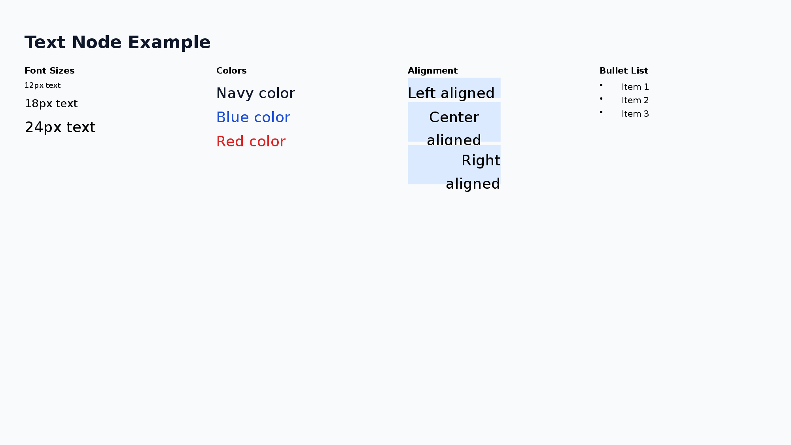
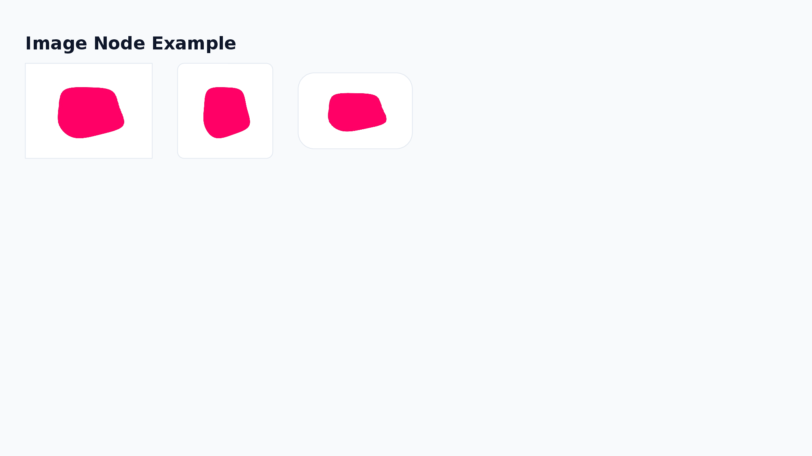
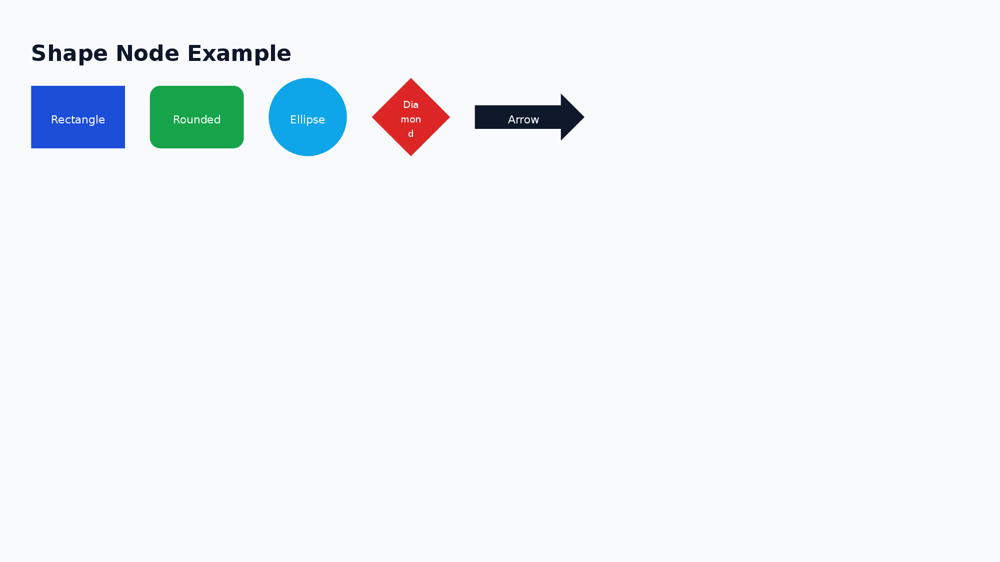
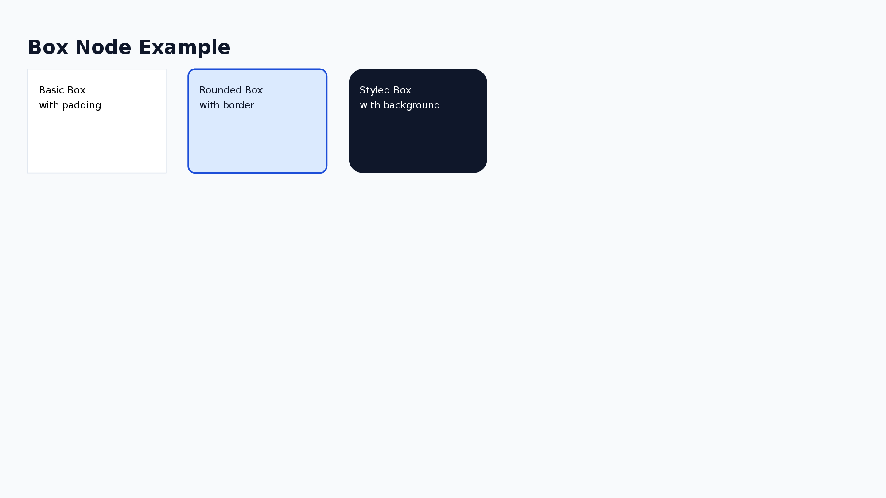
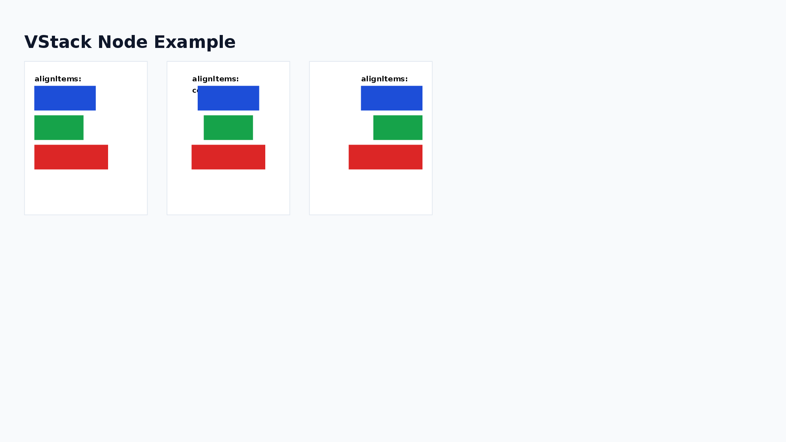
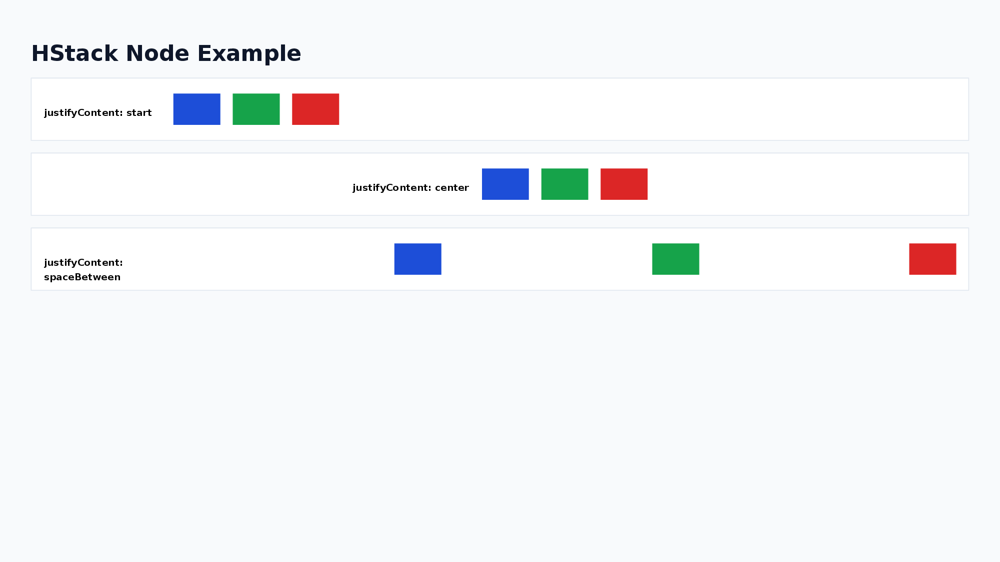
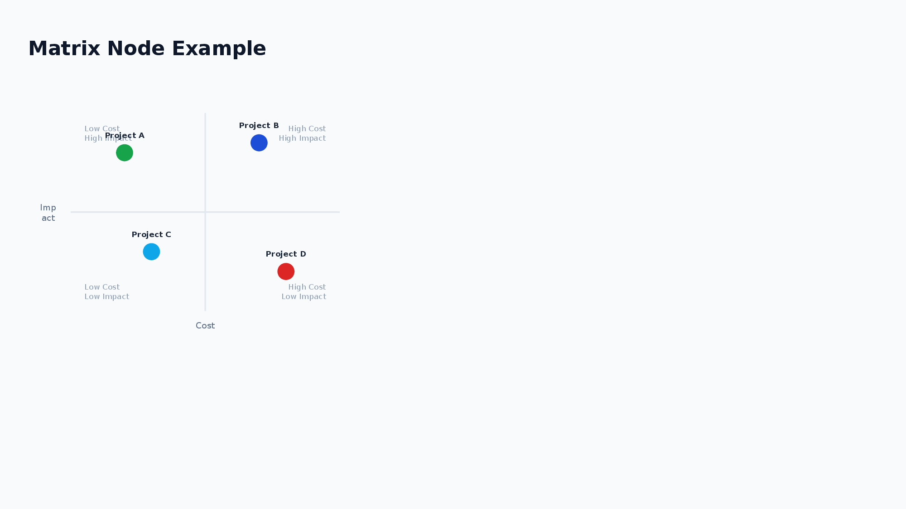

# Nodes Reference

This document provides a complete reference for all node types available in pom.

## Common Properties

Layout attributes that all nodes can have.

| Attribute         | Type                               | Description                       |
| ----------------- | ---------------------------------- | --------------------------------- |
| `w`               | number / `"max"` / `"50%"`         | Width                             |
| `h`               | number / `"max"` / `"50%"`         | Height                            |
| `minW` `maxW`     | number                             | Min/Max width                     |
| `minH` `maxH`     | number                             | Min/Max height                    |
| `padding`         | number / `'{"top":8,"bottom":8}'`  | Padding                           |
| `backgroundColor` | hex                                | Background color (e.g., `F8F9FA`) |
| `backgroundImage` | `'{"src":"url","sizing":"cover"}'` | Background image                  |
| `border`          | `'{"color":"333","width":1}'`      | Border                            |
| `borderRadius`    | number                             | Corner radius (px)                |
| `opacity`         | 0-1                                | Background transparency           |

- `backgroundImage`: `src` accepts a URL or local file path. `sizing` controls how the image fits: `"cover"` (default) fills the area, `"contain"` fits within the area.
- `border`: Can be combined with `color`, `width`, and `dashType` (`"solid"` / `"dash"` / `"dashDot"` / `"lgDash"` / `"lgDashDot"` / `"lgDashDotDot"` / `"sysDash"` / `"sysDot"`).
- `opacity`: 0 = fully transparent, 1 = fully opaque. Useful for semi-transparent overlays with Layer nodes.

## Node List

### 1. Text

A node for displaying text.



```xml
<Text fontPx="24" bold="true" color="333333" alignText="center">Title</Text>
```

| Attribute                | Type / Values                                                                       |
| ------------------------ | ----------------------------------------------------------------------------------- |
| `fontPx`                 | number (default: 24)                                                                |
| `color`                  | hex (text color)                                                                    |
| `alignText`              | `left` / `center` / `right`                                                         |
| `bold` `italic` `strike` | `true` / `false`                                                                    |
| `underline`              | `true` / `'{"style":"wavy","color":"FF0000"}'`                                      |
| `highlight`              | hex (highlight color)                                                               |
| `fontFamily`             | string (default: `Noto Sans JP`)                                                    |
| `lineSpacingMultiple`    | number (default: 1.3)                                                               |
| `bullet`                 | `true` / `'{"type":"number"}'` / `'{"type":"number","numberType":"alphaLcPeriod"}'` |

Font size guide: Title 28-40 / Heading 18-24 / Body 13-16 / Caption 10-12

**UnderlineStyle:**

`"dash"` | `"dashHeavy"` | `"dashLong"` | `"dashLongHeavy"` | `"dbl"` | `"dotDash"` | `"dotDotDash"` | `"dotted"` | `"dottedHeavy"` | `"heavy"` | `"none"` | `"sng"` | `"wavy"` | `"wavyDbl"` | `"wavyHeavy"`

**BulletOptions:**

| Property        | Type / Values                                                                                                                |
| --------------- | ---------------------------------------------------------------------------------------------------------------------------- |
| `type`          | `"bullet"` (symbol) / `"number"` (numbered)                                                                                  |
| `indent`        | number (indent level)                                                                                                        |
| `numberType`    | `alphaLcPeriod` / `alphaUcPeriod` / `arabicParenR` / `arabicPeriod` / `arabicPlain` / `romanLcPeriod` / `romanUcPeriod` etc. |
| `numberStartAt` | number (starting number)                                                                                                     |

**Usage Examples:**

```xml
<!-- Simple bullet list -->
<Text bullet="true">Item 1
Item 2
Item 3</Text>

<!-- Numbered list -->
<Text bullet='{"type":"number"}'>Step 1
Step 2
Step 3</Text>

<!-- Lowercase alphabet (a. b. c.) -->
<Text bullet='{"type":"number","numberType":"alphaLcPeriod"}'>Item A
Item B
Item C</Text>

<!-- Numbered list starting from 5 -->
<Text bullet='{"type":"number","numberStartAt":5}'>Fifth
Sixth
Seventh</Text>
```

### 2. Image

A node for displaying images.



```xml
<Image src="https://example.com/img.png" w="200" h="150" />
```

| Attribute | Type / Values                                                                                   |
| --------- | ----------------------------------------------------------------------------------------------- |
| `src`     | string (URL / path / base64)                                                                    |
| `sizing`  | `'{"type":"contain"}'` / `'{"type":"cover"}'` / `'{"type":"crop","x":0,"y":0,"w":100,"h":100}'` |
| `shadow`  | `'{"type":"outer","blur":4,"offset":2,"color":"000"}'`                                          |

- If `w` and `h` are not specified, the actual image size is automatically used.
- If size is specified, the image is displayed at that size (aspect ratio is not preserved).
- Use `sizing` to control how the image fits within its bounds:
  - `contain`: Maintains aspect ratio, fits within the specified size
  - `cover`: Maintains aspect ratio, covers the entire specified size
  - `crop`: Crops the image to the specified region

### 3. Table

A node for drawing tables. Column widths and row heights are declared in px, with fine-grained control over cell decoration.


```xml
<Table>
  <Column width="200" />
  <Column width="100" />
  <Row>
    <Cell bold="true" backgroundColor="DBEAFE">Name</Cell>
    <Cell bold="true" backgroundColor="DBEAFE">Score</Cell>
  </Row>
  <Row>
    <Cell>Alice</Cell>
    <Cell>95</Cell>
  </Row>
</Table>
```

- `<Column>`: `width` (omit for even distribution)
- `<Row>`: `height` (omit to apply `defaultRowHeight`, default 32)
- `<Cell>`: Text content + `fontPx` `color` `bold` `italic` `underline` `strike` `highlight` `alignText` `backgroundColor`

| Attribute          | Type / Values        |
| ------------------ | -------------------- |
| `defaultRowHeight` | number (default: 32) |

### 4. Shape

A node for drawing shapes. Different representations are possible with or without text, supporting complex visual effects.



```xml
<Shape shapeType="roundRect" w="200" h="60" text="Button" fontPx="16" fill='{"color":"1D4ED8"}' color="FFFFFF" />
```

| Attribute       | Type / Values                                                                        |
| --------------- | ------------------------------------------------------------------------------------ |
| `shapeType`     | `rect` / `roundRect` / `ellipse` / `triangle` / `star5` / `cloud` / `downArrow` etc. |
| `text`          | string (text inside the shape)                                                       |
| `fill`          | `'{"color":"hex","transparency":0.5}'`                                               |
| `line`          | `'{"color":"hex","width":2,"dashType":"dash"}'`                                      |
| `shadow`        | `'{"type":"outer","blur":4,"offset":2,"color":"000"}'`                               |
| Text attributes | `fontPx` `color` `alignText` `bold` `italic` `underline` `strike` `highlight`        |

**Common Shape Types:**

- `roundRect`: Rounded rectangle (title boxes, category displays)
- `ellipse`: Ellipse/circle (step numbers, badges)
- `cloud`: Cloud shape (comments, key points)
- `wedgeRectCallout`: Callout with arrow (annotations)
- `cloudCallout`: Cloud callout (comments)
- `star5`: 5-pointed star (emphasis, decoration)
- `downArrow`: Down arrow (flow diagrams)

### 5. Box

A generic container that wraps a single child element. Used for grouping with padding or fixed size.



```xml
<Box w="50%" padding="20" backgroundColor="FFFFFF">
  <Text>Content</Text>
</Box>
```

| Attribute | Type | Description                                            |
| --------- | ---- | ------------------------------------------------------ |
| `shadow`  | JSON | `'{"type":"outer","blur":4,"offset":2,"color":"000"}'` |

- Only **one** child element.

### 6. VStack

Arranges child elements **vertically**.



```xml
<VStack gap="16" alignItems="stretch" justifyContent="start">
  <Text>A</Text>
  <Text>B</Text>
</VStack>
```

| Attribute        | Values                                                                      |
| ---------------- | --------------------------------------------------------------------------- |
| `gap`            | number (gap between children)                                               |
| `alignItems`     | `start` / `center` / `end` / `stretch`                                      |
| `justifyContent` | `start` / `center` / `end` / `spaceBetween` / `spaceAround` / `spaceEvenly` |

### 7. HStack

Arranges child elements **horizontally**.



```xml
<HStack gap="16" alignItems="center" justifyContent="start">
  <Text>A</Text>
  <Text>B</Text>
</HStack>
```

| Attribute        | Values                                                                      |
| ---------------- | --------------------------------------------------------------------------- |
| `gap`            | number (gap between children)                                               |
| `alignItems`     | `start` / `center` / `end` / `stretch`                                      |
| `justifyContent` | `start` / `center` / `end` / `spaceBetween` / `spaceAround` / `spaceEvenly` |

### 8. Chart

A node for drawing charts. Supports bar charts, line charts, pie charts, area charts, doughnut charts, and radar charts.


```xml
<Chart chartType="bar" w="500" h="300" showLegend="true" chartColors='["0088CC","00AA00"]'>
  <Series name="Sales">
    <DataPoint label="Jan" value="100" />
    <DataPoint label="Feb" value="150" />
  </Series>
</Chart>
```

| Attribute     | Type / Values                                          |
| ------------- | ------------------------------------------------------ |
| `chartType`   | `bar` / `line` / `pie` / `area` / `doughnut` / `radar` |
| `showLegend`  | boolean                                                |
| `showTitle`   | boolean                                                |
| `title`       | string                                                 |
| `chartColors` | JSON array `'["hex1","hex2"]'`                         |
| `radarStyle`  | `standard` / `marker` / `filled` (radar only)          |

**Usage Examples:**

```xml
<!-- Bar chart -->
<Chart chartType="bar" w="600" h="400" showLegend="true" showTitle="true"
  title="Monthly Sales &amp; Profit" chartColors='["0088CC","00AA00"]'>
  <Series name="Sales">
    <DataPoint label="Jan" value="100" />
    <DataPoint label="Feb" value="200" />
    <DataPoint label="Mar" value="150" />
    <DataPoint label="Apr" value="300" />
  </Series>
  <Series name="Profit">
    <DataPoint label="Jan" value="30" />
    <DataPoint label="Feb" value="60" />
    <DataPoint label="Mar" value="45" />
    <DataPoint label="Apr" value="90" />
  </Series>
</Chart>

<!-- Pie chart -->
<Chart chartType="pie" w="400" h="300" showLegend="true"
  chartColors='["0088CC","00AA00","FF6600","888888"]'>
  <Series name="Market Share">
    <DataPoint label="Product A" value="40" />
    <DataPoint label="Product B" value="30" />
    <DataPoint label="Product C" value="20" />
    <DataPoint label="Others" value="10" />
  </Series>
</Chart>

<!-- Radar chart -->
<Chart chartType="radar" w="400" h="300" showLegend="true"
  radarStyle="filled" chartColors='["0088CC"]'>
  <Series name="Skill Assessment">
    <DataPoint label="Technical" value="80" />
    <DataPoint label="Design" value="60" />
    <DataPoint label="PM" value="70" />
    <DataPoint label="Sales" value="50" />
    <DataPoint label="Support" value="90" />
  </Series>
</Chart>
```

### 9. Timeline

A node for creating timeline/roadmap visualizations. Supports horizontal and vertical layouts.


```xml
<Timeline direction="horizontal" w="1000" h="120">
  <TimelineItem date="Q1" title="Phase 1" description="Foundation" color="4CAF50" />
  <TimelineItem date="Q2" title="Phase 2" description="Development" color="2196F3" />
</Timeline>
```

| Attribute   | Values                    |
| ----------- | ------------------------- |
| `direction` | `horizontal` / `vertical` |

`<TimelineItem>`: `date` (required) `title` (required) `description` `color`

**Usage Examples:**

```xml
<!-- Horizontal roadmap -->
<Timeline direction="horizontal" w="1000" h="120">
  <TimelineItem date="2025/Q1" title="Phase 1" description="Foundation" color="4CAF50" />
  <TimelineItem date="2025/Q2" title="Phase 2" description="Development" color="2196F3" />
  <TimelineItem date="2025/Q3" title="Phase 3" description="Testing" color="FF9800" />
  <TimelineItem date="2025/Q4" title="Phase 4" description="Release" color="E91E63" />
</Timeline>

<!-- Vertical project plan -->
<Timeline direction="vertical" w="400" h="300">
  <TimelineItem date="Week 1" title="Planning" />
  <TimelineItem date="Week 2-3" title="Development" />
  <TimelineItem date="Week 4" title="Release" />
</Timeline>
```

### 10. Matrix

A node for creating 2x2 matrix/positioning maps. Commonly used for cost-effectiveness analysis, impact-effort prioritization, etc.



```xml
<Matrix w="600" h="500">
  <Axes x="Cost" y="Effect" />
  <Quadrants topLeft="Quick Wins" topRight="Strategic" bottomLeft="Low Priority" bottomRight="Avoid" />
  <MatrixItem label="Initiative A" x="0.2" y="0.8" color="4CAF50" />
  <MatrixItem label="Initiative B" x="0.7" y="0.6" />
</Matrix>
```

- Coordinates: (0,0)=bottom-left, (1,1)=top-right (mathematical coordinate system)
- `<Axes>`: `x` `y` (axis labels, required)
- `<Quadrants>`: `topLeft` `topRight` `bottomLeft` `bottomRight`
- `<MatrixItem>`: `label` `x` `y` (required) `color`

**Usage Examples:**

```xml
<!-- Cost-Effectiveness Matrix -->
<Matrix w="600" h="500">
  <Axes x="Cost" y="Effect" />
  <Quadrants
    topLeft="Low Cost / High Effect (Priority)"
    topRight="High Cost / High Effect (Consider)"
    bottomLeft="Low Cost / Low Effect (Low Priority)"
    bottomRight="High Cost / Low Effect (Avoid)" />
  <MatrixItem label="Initiative A" x="0.2" y="0.8" color="4CAF50" />
  <MatrixItem label="Initiative B" x="0.7" y="0.6" color="2196F3" />
  <MatrixItem label="Initiative C" x="0.3" y="0.3" color="FF9800" />
  <MatrixItem label="Initiative D" x="0.8" y="0.2" color="E91E63" />
</Matrix>

<!-- Simple Impact-Effort Matrix (without quadrant labels) -->
<Matrix w="500" h="400">
  <Axes x="Effort" y="Impact" />
  <MatrixItem label="Quick Win" x="0.15" y="0.85" />
  <MatrixItem label="Major Project" x="0.75" y="0.75" />
  <MatrixItem label="Fill-In" x="0.25" y="0.25" />
  <MatrixItem label="Time Sink" x="0.85" y="0.15" />
</Matrix>
```

### 11. Tree

A node for creating tree structures such as organization charts, decision trees, and hierarchical diagrams.


```xml
<Tree layout="vertical" nodeShape="roundRect" w="600" h="400">
  <TreeItem label="CEO" color="1D4ED8">
    <TreeItem label="CTO" color="0EA5E9">
      <TreeItem label="Engineer A" />
    </TreeItem>
    <TreeItem label="CFO" color="16A34A" />
  </TreeItem>
</Tree>
```

| Attribute        | Type / Values                    |
| ---------------- | -------------------------------- |
| `layout`         | `vertical` / `horizontal`        |
| `nodeShape`      | `rect` / `roundRect` / `ellipse` |
| `nodeWidth`      | number (default: 120)            |
| `nodeHeight`     | number (default: 40)             |
| `levelGap`       | number (default: 60)             |
| `siblingGap`     | number (default: 20)             |
| `connectorStyle` | `'{"color":"333","width":2}'`    |

`<TreeItem>` can be nested recursively. The root must have exactly one `<TreeItem>`.

**Usage Examples:**

```xml
<!-- Vertical Organization Chart -->
<Tree layout="vertical" nodeShape="roundRect" w="600" h="400"
  connectorStyle='{"color":"333333","width":2}'>
  <TreeItem label="CEO" color="1D4ED8">
    <TreeItem label="CTO" color="0EA5E9">
      <TreeItem label="Engineer A" />
      <TreeItem label="Engineer B" />
    </TreeItem>
    <TreeItem label="CFO" color="16A34A">
      <TreeItem label="Accountant" />
    </TreeItem>
  </TreeItem>
</Tree>

<!-- Horizontal Decision Tree -->
<Tree layout="horizontal" nodeShape="rect" w="600" h="300">
  <TreeItem label="Start">
    <TreeItem label="Option A">
      <TreeItem label="Result 1" />
      <TreeItem label="Result 2" />
    </TreeItem>
    <TreeItem label="Option B">
      <TreeItem label="Result 3" />
    </TreeItem>
  </TreeItem>
</Tree>
```

### 12. Flow

A node for creating flowcharts. Supports various node shapes and automatic layout.


```xml
<Flow direction="horizontal" w="500" h="300">
  <FlowNode id="start" shape="flowChartTerminator" text="Start" color="4CAF50" />
  <FlowNode id="process" shape="flowChartProcess" text="Process" />
  <FlowNode id="decision" shape="flowChartDecision" text="OK?" color="FF9800" />
  <FlowNode id="end" shape="flowChartTerminator" text="End" color="E91E63" />
  <Connection from="start" to="process" />
  <Connection from="process" to="decision" />
  <Connection from="decision" to="end" label="Yes" />
</Flow>
```

| Attribute        | Type / Values                                     |
| ---------------- | ------------------------------------------------- |
| `direction`      | `horizontal` / `vertical`                         |
| `nodeWidth`      | number (default: 120)                             |
| `nodeHeight`     | number (default: 60)                              |
| `nodeGap`        | number (default: 80)                              |
| `connectorStyle` | `'{"color":"hex","width":2,"arrowType":"arrow"}'` |

`<FlowNode>` shapes:
`flowChartTerminator` / `flowChartProcess` / `flowChartDecision` / `flowChartInputOutput` / `flowChartDocument` / `flowChartPredefinedProcess` / `flowChartConnector` / `flowChartPreparation` / `flowChartManualInput` / `flowChartManualOperation` / `flowChartDelay` / `flowChartMagneticDisk`

`<Connection>`: `from` `to` (required) `label` `color`

**Usage Examples:**

```xml
<!-- Simple vertical flowchart -->
<Flow direction="vertical" w="400" h="300">
  <FlowNode id="start" shape="flowChartTerminator" text="Start" color="4CAF50" />
  <FlowNode id="process" shape="flowChartProcess" text="Process" />
  <FlowNode id="decision" shape="flowChartDecision" text="OK?" color="FF9800" />
  <FlowNode id="end" shape="flowChartTerminator" text="End" color="E91E63" />
  <Connection from="start" to="process" />
  <Connection from="process" to="decision" />
  <Connection from="decision" to="end" label="Yes" />
</Flow>

<!-- Horizontal flowchart -->
<Flow direction="horizontal" w="600" h="200">
  <FlowNode id="input" shape="flowChartInputOutput" text="Input" />
  <FlowNode id="validate" shape="flowChartProcess" text="Validate" />
  <FlowNode id="save" shape="flowChartProcess" text="Save" />
  <FlowNode id="output" shape="flowChartInputOutput" text="Output" />
  <Connection from="input" to="validate" />
  <Connection from="validate" to="save" />
  <Connection from="save" to="output" />
</Flow>
```

### 13. ProcessArrow

A node for creating chevron-style process diagrams. Commonly used for visualizing sequential steps in a workflow.


```xml
<ProcessArrow direction="horizontal" w="1000" h="80">
  <Step label="Planning" color="4472C4" />
  <Step label="Design" color="5B9BD5" />
  <Step label="Development" color="70AD47" />
  <Step label="Release" color="ED7D31" />
</ProcessArrow>
```

| Attribute                | Type / Values                                  |
| ------------------------ | ---------------------------------------------- |
| `direction`              | `horizontal` / `vertical`                      |
| `itemWidth`              | number (default: 150)                          |
| `itemHeight`             | number (default: 60)                           |
| `gap`                    | number (default: -15, negative for overlap)    |
| `fontPx`                 | number (default: 14)                           |
| `bold` `italic` `strike` | boolean                                        |
| `underline`              | `true` / `'{"style":"wavy","color":"FF0000"}'` |
| `highlight`              | hex (highlight color)                          |

`<Step>`: `label` (required) `color` (default: `4472C4`) `textColor` (default: `FFFFFF`)

**Usage Examples:**

```xml
<!-- Horizontal process arrow with colors -->
<ProcessArrow direction="horizontal" w="1000" h="80">
  <Step label="Planning" color="4472C4" />
  <Step label="Design" color="5B9BD5" />
  <Step label="Development" color="70AD47" />
  <Step label="Testing" color="FFC000" />
  <Step label="Release" color="ED7D31" />
</ProcessArrow>

<!-- Vertical process arrow -->
<ProcessArrow direction="vertical" w="200" h="250">
  <Step label="Phase 1" color="4CAF50" />
  <Step label="Phase 2" color="2196F3" />
  <Step label="Phase 3" color="9C27B0" />
</ProcessArrow>

<!-- Custom styling -->
<ProcessArrow direction="horizontal" w="600" h="80"
  itemWidth="180" itemHeight="70" fontPx="16" bold="true">
  <Step label="Input" color="2196F3" />
  <Step label="Process" color="00BCD4" />
  <Step label="Output" color="009688" />
</ProcessArrow>
```

### 14. Line

A node for drawing lines and arrows. Uses absolute coordinates (x1, y1, x2, y2) for start and end points.


```xml
<Line x1="100" y1="100" x2="300" y2="100" color="333333" lineWidth="2" endArrow="true" />
```

| Attribute                 | Type / Values                                                                     |
| ------------------------- | --------------------------------------------------------------------------------- |
| `x1` `y1` `x2` `y2`       | number (absolute coordinates, required)                                           |
| `color`                   | hex (default: `000000`)                                                           |
| `lineWidth`               | number (default: 1)                                                               |
| `dashType`                | `solid` / `dash` / `dashDot` / `lgDash` / `sysDash` etc.                          |
| `beginArrow` / `endArrow` | `true` / `'{"type":"triangle"}'` (type: none/arrow/triangle/diamond/oval/stealth) |

Note: Line nodes use absolute coordinates on the slide and are not affected by Yoga layout calculations.

**Usage Examples:**

```xml
<!-- Simple horizontal line -->
<Line x1="100" y1="100" x2="300" y2="100" color="333333" lineWidth="2" />

<!-- Arrow pointing right -->
<Line x1="100" y1="150" x2="300" y2="150" color="333333" lineWidth="2" endArrow="true" />

<!-- Bidirectional arrow -->
<Line x1="100" y1="200" x2="300" y2="200" color="333333" lineWidth="2" beginArrow="true" endArrow="true" />

<!-- Diagonal line with arrow (bottom-right direction) -->
<Line x1="100" y1="100" x2="250" y2="200" color="1D4ED8" lineWidth="2" endArrow="true" />

<!-- Dashed line -->
<Line x1="100" y1="250" x2="300" y2="250" color="333333" lineWidth="2" dashType="dash" />

<!-- Custom arrow type (diamond) -->
<Line x1="100" y1="300" x2="300" y2="300" color="1D4ED8" lineWidth="2" endArrow='{"type":"diamond"}' />
```

### 15. Layer

A container for absolute positioning of child elements. Child elements are positioned using `x` and `y` coordinates relative to the layer's top-left corner.


```xml
<Layer w="600" h="400">
  <Shape shapeType="roundRect" x="50" y="50" w="120" h="80" fill='{"color":"1D4ED8"}' text="A" color="FFFFFF" />
  <Line x1="170" y1="90" x2="300" y2="90" endArrow="true" />
</Layer>
```

- Child elements can have `x` `y` attributes (relative to layer's top-left corner, defaults to `0`).
- Drawing order follows document order (later elements are drawn on top).
- Layer itself participates in Flexbox layout (can be placed in VStack/HStack).
- Layers can be nested.

**Usage Examples:**

```xml
<!-- Basic absolute positioning with overlapping shapes -->
<Layer w="600" h="400" backgroundColor="F0F4F8">
  <!-- Back shape (drawn first) -->
  <Shape shapeType="rect" x="50" y="50" w="120" h="100" fill='{"color":"1D4ED8"}' text="Back" color="FFFFFF" />
  <!-- Front shape (drawn on top) -->
  <Shape shapeType="rect" x="100" y="80" w="120" h="100" fill='{"color":"DC2626"}' text="Front" color="FFFFFF" />
</Layer>

<!-- Layer with VStack children for free-form layout -->
<Layer w="800" h="300" backgroundColor="F8FAFC">
  <VStack x="20" y="20" w="200" gap="8" padding="12" backgroundColor="FFFFFF">
    <Text fontPx="14" bold="true">Left Column</Text>
    <Text fontPx="12">Content A</Text>
  </VStack>
  <VStack x="300" y="20" w="200" gap="8" padding="12" backgroundColor="FFFFFF">
    <Text fontPx="14" bold="true">Right Column</Text>
    <Text fontPx="12">Content B</Text>
  </VStack>
</Layer>

<!-- Connection diagram with lines -->
<Layer w="800" h="200" backgroundColor="F8FAFC">
  <Shape shapeType="roundRect" x="50" y="60" w="150" h="80" fill='{"color":"1D4ED8"}' text="Service A" color="FFFFFF" />
  <Shape shapeType="roundRect" x="350" y="60" w="150" h="80" fill='{"color":"16A34A"}' text="Service B" color="FFFFFF" />
  <Line x1="200" y1="100" x2="350" y2="100" color="333333" lineWidth="2" endArrow="true" />
  <Text x="240" y="70" fontPx="10">API Call</Text>
</Layer>

<!-- Nested layers -->
<Layer w="600" h="150" backgroundColor="E3F2FD">
  <Text x="10" y="10" fontPx="12" bold="true">Outer Layer</Text>
  <Layer x="50" y="40" w="200" h="80" backgroundColor="FFF3E0">
    <Text x="10" y="30" fontPx="11">Inner Layer</Text>
  </Layer>
</Layer>
```
