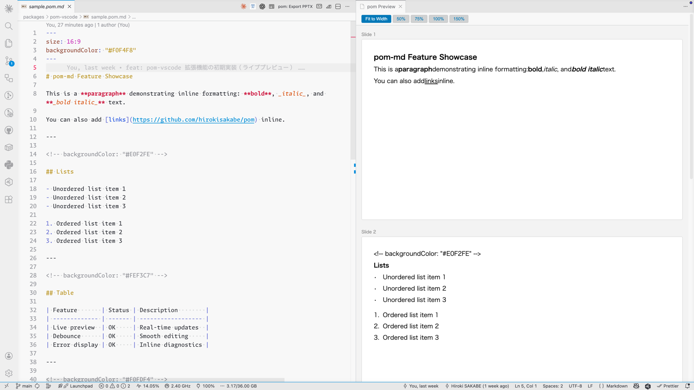

<h1 align="center">pom-vscode</h1>

  VS Code extension for live preview of pom-md / pom XML presentations.

  
  

---

## Overview

**pom-vscode** brings live slide preview to VS Code. Write presentations in Markdown (`.pom.md`) or XML (`.pom.xml`) and see the result instantly — no manual export needed during editing.

## Features

- **Live Preview** — Real-time slide preview as you edit. Changes are reflected instantly.
- **Editor Integration** — Preview button appears in the editor title bar for `.pom.md` / `.pom.xml` files.
- **PPTX Export** — Export to PowerPoint via `pom: Export PPTX` command.
- **Error Diagnostics** — Inline error display helps you catch issues as you type.
- **Command Palette** — Open preview via `pom: Open Preview`, export via `pom: Export PPTX`.

## Getting Started

> Requires VS Code 1.85+

### Install

Search for **pom** in the VS Code Extensions view, or install from the [Visual Studio Marketplace](https://marketplace.visualstudio.com/items?itemName=hirokisakabe.pom-vscode).

### Usage

1. Create a new file with `.pom.md` or `.pom.xml` extension
2. Click the preview icon in the editor title bar, or run `pom: Open Preview` from the Command Palette
3. Edit your file — the preview updates in real time
4. When ready, run `pom: Export PPTX` to generate a PowerPoint file

### Supported Formats

| Format  | Extension  | Description                                       |
| ------- | ---------- | ------------------------------------------------- |
| pom-md  | `.pom.md`  | Markdown-based presentation syntax. Easy to write |
| pom XML | `.pom.xml` | XML-based syntax. Fine-grained layout control     |

See the [pom documentation](https://github.com/hirokisakabe/pom) for details.

## License

MIT
