# Nodes

This document provides a complete reference for all node types available in pom.

## Common Properties

Layout attributes that all nodes can have.

| Attribute         | Type                                                                       | Description                         |
| ----------------- | -------------------------------------------------------------------------- | ----------------------------------- |
| `w`               | number / `"max"` / `"50%"`                                                 | Width                               |
| `h`               | number / `"max"` / `"50%"`                                                 | Height                              |
| `minW` `maxW`     | number                                                                     | Min/Max width                       |
| `minH` `maxH`     | number                                                                     | Min/Max height                      |
| `padding`         | number / `padding.top="8" padding.bottom="8"`                              | Padding                             |
| `backgroundColor` | hex                                                                        | Background color (e.g., `F8F9FA`)   |
| `backgroundImage` | `backgroundImage.src="url" backgroundImage.sizing="cover"`                 | Background image                    |
| `border`          | `border.color="333" border.width="1"`                                      | Border                              |
| `borderRadius`    | number                                                                     | Corner radius (px)                  |
| `opacity`         | 0-1                                                                        | Background transparency             |
| `margin`          | number / `margin.top="8" margin.bottom="8"`                                | Outer margin                        |
| `zIndex`          | number                                                                     | Stacking order (higher = on top)    |
| `position`        | `relative` / `absolute`                                                    | Positioning mode                    |
| `top`             | number                                                                     | Top offset (with position)          |
| `right`           | number                                                                     | Right offset (with position)        |
| `bottom`          | number                                                                     | Bottom offset (with position)       |
| `left`            | number                                                                     | Left offset (with position)         |
| `alignSelf`       | `auto` / `start` / `center` / `end` / `stretch`                            | Override parent alignItems          |
| `shadow`          | `shadow.type="outer" shadow.blur="4" shadow.offset="2" shadow.color="000"` | Drop shadow (not supported on Line) |

- `backgroundImage`: `src` accepts a URL or local file path. `sizing` controls how the image fits: `"cover"` (default) fills the area, `"contain"` fits within the area.
- `border`: Can be combined with `color`, `width`, and `dashType` (`"solid"` / `"dash"` / `"dashDot"` / `"lgDash"` / `"lgDashDot"` / `"lgDashDotDot"` / `"sysDash"` / `"sysDot"`).
- `opacity`: 0 = fully transparent, 1 = fully opaque. Useful for semi-transparent overlays with Layer nodes.
- Shorthand (`padding="16"` / `border='{"color":"333","width":1}'`) and dot notation (`padding.top="8"` / `border.color="FF0000"`) can be mixed on the same node. Shorthand is used as the default value, then dot notation overrides each top-level key.
- Mixed shorthand + dot notation is supported for: `padding` `margin` `border` `cellBorder` `line` `fill` `shadow` `underline` `beginArrow` `endArrow` `backgroundImage` `connectorStyle` `sizing`.

## Node List

### 1. Text

A node for displaying text.

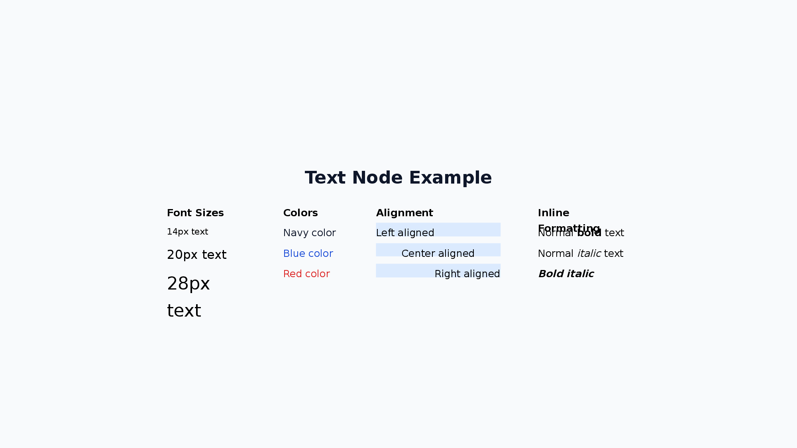

```xml
<Text fontSize="24" bold="true" color="333333" textAlign="center">Title</Text>
```

| Attribute                | Values                                                     |
| ------------------------ | ---------------------------------------------------------- |
| `fontSize`               | number (default: 24)                                       |
| `color`                  | hex (text color)                                           |
| `textAlign`              | `left` / `center` / `right`                                |
| `bold` `italic` `strike` | `true` / `false`                                           |
| `underline`              | `true` / `underline.style="wavy" underline.color="FF0000"` |
| `highlight`              | hex (highlight color)                                      |
| `fontFamily`             | string (default: `Noto Sans JP`)                           |
| `lineHeight`             | number (default: 1.3)                                      |

**Inline Formatting:**

Use `<B>`, `<I>`, `<A>`, `<U>`, `<S>`, `<Mark>`, and `<Span>` child elements for partial bold/italic/underline/strikethrough/highlight/color and hyperlinks within a single text node:

```xml
<Text fontSize="16">Normal <B>bold</B> and <I>italic</I> text</Text>
<Text fontSize="16"><B><I>Bold italic</I></B></Text>
<Text fontSize="16">Visit <A href="https://example.com">our site</A></Text>
<Text fontSize="16">Normal <U>underline</U> and <S>strikethrough</S> text</Text>
<Text fontSize="16"><Mark color="FFFF00">highlighted</Mark> text</Text>
<Text fontSize="16"><B><U>Bold underline nested</U></B></Text>
<Text fontSize="16">Normal <Span color="FF0000">red text</Span> normal</Text>
<Text fontSize="16"><B><Span color="1D4ED8">bold blue</Span></B></Text>
```

See [Styling Guide](./styling-guide.md#font-size-guide) for recommended font sizes.

**UnderlineStyle:**

`"dash"` | `"dashHeavy"` | `"dashLong"` | `"dashLongHeavy"` | `"dbl"` | `"dotDash"` | `"dotDotDash"` | `"dotted"` | `"dottedHeavy"` | `"heavy"` | `"none"` | `"sng"` | `"wavy"` | `"wavyDbl"` | `"wavyHeavy"`

### 2. Ul (Unordered List)

A node for displaying bullet-point lists. Use `<Li>` child elements to define list items.

```xml
<Ul fontSize="14" color="333333">
  <Li>Item A</Li>
  <Li>Item B</Li>
  <Li bold="true">Item C (bold)</Li>
</Ul>
```

**Ul Attributes:**

| Attribute                | Values                           |
| ------------------------ | -------------------------------- |
| `fontSize`               | number (default: 24)             |
| `color`                  | hex (text color)                 |
| `textAlign`              | `left` / `center` / `right`      |
| `bold` `italic` `strike` | `true` / `false`                 |
| `underline`              | `true` / underline options       |
| `highlight`              | hex (highlight color)            |
| `fontFamily`             | string (default: `Noto Sans JP`) |
| `lineHeight`             | number (default: 1.3)            |

**Li Attributes (overrides parent Ul/Ol style):**

| Attribute                | Values                     |
| ------------------------ | -------------------------- |
| `fontSize`               | number                     |
| `color`                  | hex (text color)           |
| `bold` `italic` `strike` | `true` / `false`           |
| `underline`              | `true` / underline options |
| `highlight`              | hex (highlight color)      |
| `fontFamily`             | string                     |

Li also supports `<B>`, `<I>`, `<A>`, `<U>`, `<S>`, `<Mark>`, and `<Span>` inline formatting: `<Li>Normal <B>bold</B> item</Li>`, `<Li>See <A href="https://example.com">link</A></Li>`, `<Li><U>underline</U> item</Li>`, `<Li><Span color="FF0000">red</Span> item</Li>`

### 3. Ol (Ordered List)

A node for displaying numbered lists. Has all Ul attributes plus the following:

```xml
<Ol fontSize="14" numberType="alphaLcPeriod" numberStartAt="3">
  <Li>Item A</Li>
  <Li>Item B</Li>
</Ol>
```

**Additional Ol Attributes:**

| Attribute       | Values                                                                                                                       |
| --------------- | ---------------------------------------------------------------------------------------------------------------------------- |
| `numberType`    | `alphaLcPeriod` / `alphaUcPeriod` / `arabicParenR` / `arabicPeriod` / `arabicPlain` / `romanLcPeriod` / `romanUcPeriod` etc. |
| `numberStartAt` | number (starting number, default: 1)                                                                                         |

### 4. Image

A node for displaying images.

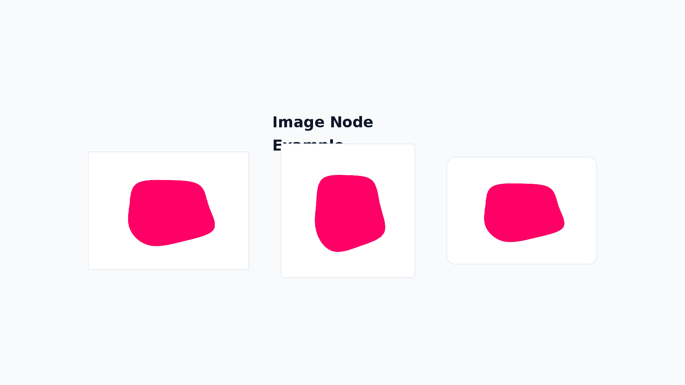

```xml
<Image src="https://placehold.co/200x150" w="200" h="150" />
```

| Attribute | Values                                                                                          |
| --------- | ----------------------------------------------------------------------------------------------- |
| `src`     | string (URL / path / base64)                                                                    |
| `sizing`  | `'{"type":"contain"}'` / `'{"type":"cover"}'` / `'{"type":"crop","x":0,"y":0,"w":100,"h":100}'` |

- If `w` and `h` are not specified, the actual image size is automatically used.
- If size is specified, the image is displayed at that size (aspect ratio is not preserved).
- Use `sizing` to control how the image fits within its bounds:
  - `contain`: Maintains aspect ratio, fits within the specified size
  - `cover`: Maintains aspect ratio, covers the entire specified size
  - `crop`: Crops the image to the specified region

### 5. Table

A node for drawing tables. Column widths and row heights are declared in px, with fine-grained control over cell decoration.

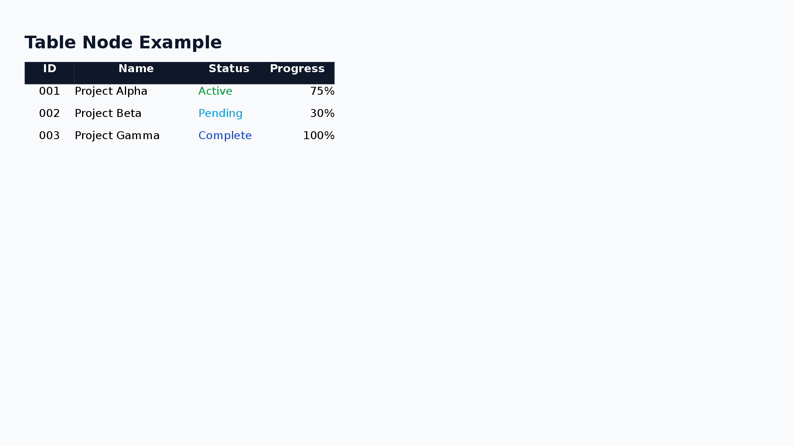

```xml
<Table>
  <Col width="200" />
  <Col width="100" />
  <Tr>
    <Td bold="true" backgroundColor="DBEAFE">Name</Td>
    <Td bold="true" backgroundColor="DBEAFE">Score</Td>
  </Tr>
  <Tr>
    <Td>Alice</Td>
    <Td>95</Td>
  </Tr>
</Table>
```

- `<Col>`: `width` (omit for even distribution)
- `<Tr>`: `height` (omit to apply `defaultRowHeight`, default 32)
- `<Td>`: Text content + `fontSize` `color` `bold` `italic` `underline` `strike` `highlight` `textAlign` `backgroundColor` `colspan` `rowspan`. Also supports `<B>`, `<I>`, `<A>`, `<U>`, `<S>`, `<Mark>`, and `<Span>` inline formatting

| Attribute          | Values                                         |
| ------------------ | ---------------------------------------------- |
| `defaultRowHeight` | number (default: 32)                           |
| `cellBorder`       | `{color, width, dashType}` — cell border style |

### 6. Shape

A node for drawing shapes. Different representations are possible with or without text, supporting complex visual effects.

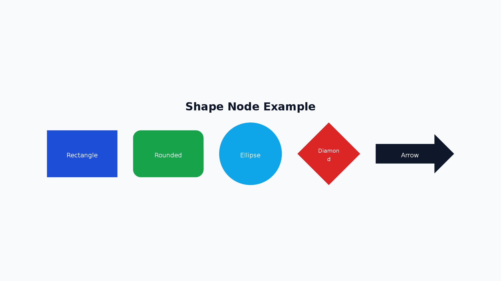

```xml
<Shape shapeType="roundRect" w="200" h="60" text="Button" fontSize="16" fill.color="1D4ED8" color="FFFFFF" />
```

| Attribute       | Values                                                                                                    |
| --------------- | --------------------------------------------------------------------------------------------------------- |
| `shapeType`     | Shape type (178 types — see list below)                                                                   |
| `text`          | string (text inside the shape)                                                                            |
| `fill`          | `fill.color="hex" fill.transparency="0.5"`                                                                |
| `line`          | `line.color="hex" line.width="2" line.dashType="dash"`                                                    |
| Text attributes | `fontSize` `color` `textAlign` `bold` `italic` `underline` `strike` `highlight` `fontFamily` `lineHeight` |

**Common Shape Types:**

- `roundRect`: Rounded rectangle (title boxes, category displays)
- `ellipse`: Ellipse/circle (step numbers, badges)
- `cloud`: Cloud shape (comments, key points)
- `wedgeRectCallout`: Callout with arrow (annotations)
- `cloudCallout`: Cloud callout (comments)
- `star5`: 5-pointed star (emphasis, decoration)
- `downArrow`: Down arrow (flow diagrams)

<details>
<summary>All Shape Types (178 types)</summary>

**Basic Shapes:**
`arc`, `bevel`, `blockArc`, `can`, `chord`, `corner`, `cube`, `decagon`, `diagStripe`, `diamond`, `dodecagon`, `donut`, `ellipse`, `folderCorner`, `frame`, `funnel`, `halfFrame`, `heptagon`, `hexagon`, `homePlate`, `nonIsoscelesTrapezoid`, `octagon`, `parallelogram`, `pentagon`, `pie`, `pieWedge`, `plaque`, `plus`, `rect`, `roundRect`, `rtTriangle`, `trapezoid`, `triangle`

**Rounded & Snipped Rectangles:**
`round1Rect`, `round2DiagRect`, `round2SameRect`, `snip1Rect`, `snip2DiagRect`, `snip2SameRect`, `snipRoundRect`

**Arrows:**
`bentArrow`, `bentUpArrow`, `chevron`, `circularArrow`, `curvedDownArrow`, `curvedLeftArrow`, `curvedRightArrow`, `curvedUpArrow`, `downArrow`, `leftArrow`, `leftCircularArrow`, `leftRightArrow`, `leftRightCircularArrow`, `leftRightUpArrow`, `leftUpArrow`, `notchedRightArrow`, `quadArrow`, `rightArrow`, `stripedRightArrow`, `swooshArrow`, `upArrow`, `upDownArrow`, `uturnArrow`

**Arrow Callouts:**
`downArrowCallout`, `leftArrowCallout`, `leftRightArrowCallout`, `quadArrowCallout`, `rightArrowCallout`, `upArrowCallout`, `upDownArrowCallout`

**Callouts:**
`accentBorderCallout1`, `accentBorderCallout2`, `accentBorderCallout3`, `accentCallout1`, `accentCallout2`, `accentCallout3`, `borderCallout1`, `borderCallout2`, `borderCallout3`, `callout1`, `callout2`, `callout3`, `cloudCallout`, `wedgeEllipseCallout`, `wedgeRectCallout`, `wedgeRoundRectCallout`

**Stars & Banners:**
`doubleWave`, `ellipseRibbon`, `ellipseRibbon2`, `horizontalScroll`, `irregularSeal1`, `irregularSeal2`, `leftRightRibbon`, `ribbon`, `ribbon2`, `star4`, `star5`, `star6`, `star7`, `star8`, `star10`, `star12`, `star16`, `star24`, `star32`, `verticalScroll`, `wave`

**Flowchart:**
`flowChartAlternateProcess`, `flowChartCollate`, `flowChartConnector`, `flowChartDecision`, `flowChartDelay`, `flowChartDisplay`, `flowChartDocument`, `flowChartExtract`, `flowChartInputOutput`, `flowChartInternalStorage`, `flowChartMagneticDisk`, `flowChartMagneticDrum`, `flowChartMagneticTape`, `flowChartManualInput`, `flowChartManualOperation`, `flowChartMerge`, `flowChartMultidocument`, `flowChartOfflineStorage`, `flowChartOffpageConnector`, `flowChartOnlineStorage`, `flowChartOr`, `flowChartPredefinedProcess`, `flowChartPreparation`, `flowChartProcess`, `flowChartPunchedCard`, `flowChartPunchedTape`, `flowChartSort`, `flowChartSummingJunction`, `flowChartTerminator`

**Action Buttons:**
`actionButtonBackPrevious`, `actionButtonBeginning`, `actionButtonBlank`, `actionButtonDocument`, `actionButtonEnd`, `actionButtonForwardNext`, `actionButtonHelp`, `actionButtonHome`, `actionButtonInformation`, `actionButtonMovie`, `actionButtonReturn`, `actionButtonSound`

**Brackets & Braces:**
`bracePair`, `bracketPair`, `leftBrace`, `leftBracket`, `rightBrace`, `rightBracket`

**Math Symbols:**
`mathDivide`, `mathEqual`, `mathMinus`, `mathMultiply`, `mathNotEqual`, `mathPlus`

**Others:**
`chartPlus`, `chartStar`, `chartX`, `cloud`, `cornerTabs`, `gear6`, `gear9`, `heart`, `lightningBolt`, `line`, `lineInv`, `moon`, `noSmoking`, `plaqueTabs`, `smileyFace`, `squareTabs`, `sun`, `teardrop`

</details>

### 7. VStack

Arranges child elements **vertically**.

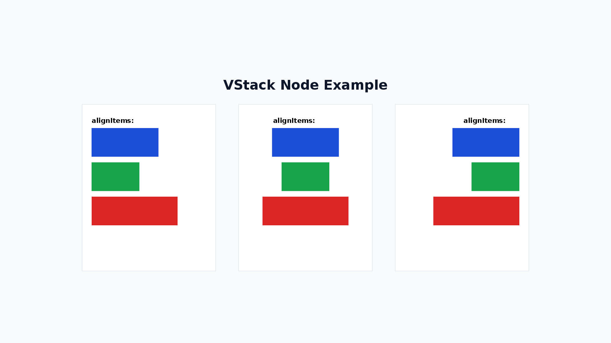

```xml
<VStack gap="16" alignItems="stretch" justifyContent="start">
  <Text>A</Text>
  <Text>B</Text>
</VStack>
```

| Attribute        | Values                                                                      |
| ---------------- | --------------------------------------------------------------------------- |
| `gap`            | number (gap between children)                                               |
| `alignItems`     | `start` / `center` / `end` / `stretch`                                      |
| `justifyContent` | `start` / `center` / `end` / `spaceBetween` / `spaceAround` / `spaceEvenly` |
| `flexWrap`       | `nowrap` / `wrap` / `wrapReverse`                                           |

> **Note:** Child elements of VStack have `flexShrink=1` by default (same as CSS Flexbox), so percentage-based heights combined with `gap` will shrink automatically to fit within the parent.

### 8. HStack

Arranges child elements **horizontally**.

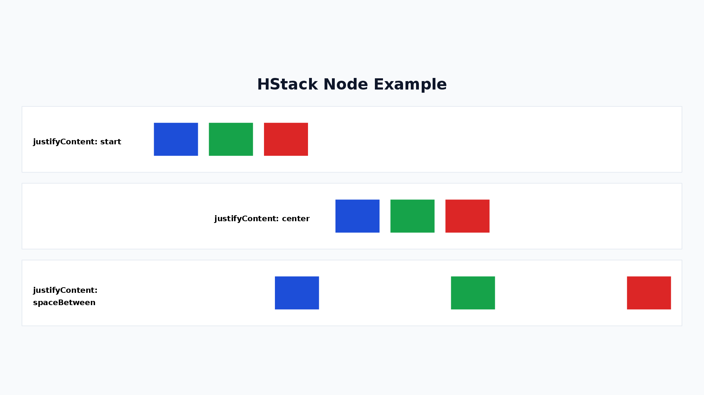

```xml
<HStack gap="16" alignItems="center" justifyContent="start">
  <Text>A</Text>
  <Text>B</Text>
</HStack>
```

| Attribute        | Values                                                                      |
| ---------------- | --------------------------------------------------------------------------- |
| `gap`            | number (gap between children)                                               |
| `alignItems`     | `start` / `center` / `end` / `stretch`                                      |
| `justifyContent` | `start` / `center` / `end` / `spaceBetween` / `spaceAround` / `spaceEvenly` |
| `flexWrap`       | `nowrap` / `wrap` / `wrapReverse`                                           |

> **Note:** Child elements of HStack have `flexShrink=1` by default (same as CSS Flexbox), so percentage-based widths combined with `gap` will shrink automatically to fit within the parent.

### 9. Chart

A node for drawing charts. Supports bar charts, line charts, pie charts, area charts, doughnut charts, and radar charts.

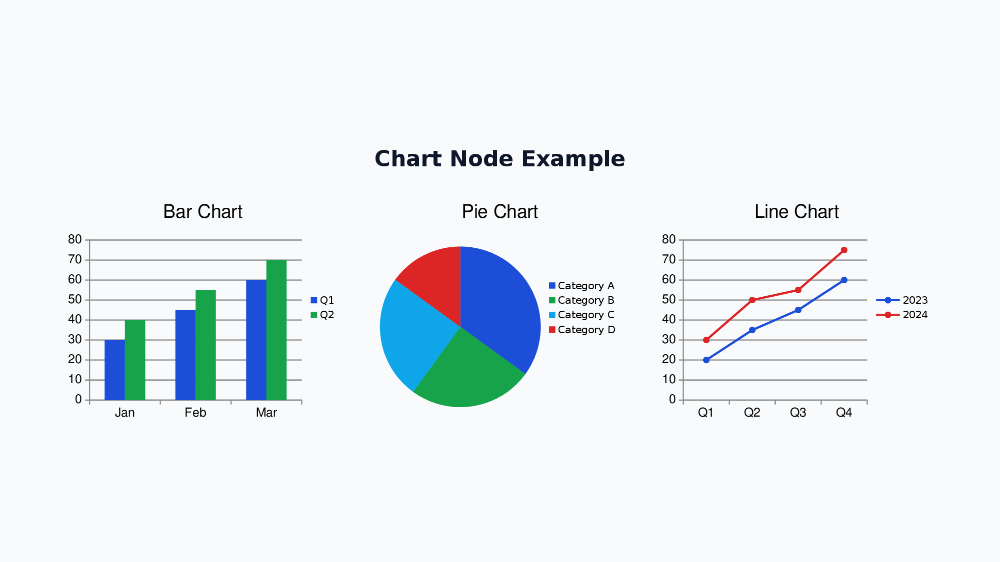

```xml
<Chart chartType="bar" w="500" h="300" showLegend="true" chartColors='["0088CC","00AA00"]'>
  <ChartSeries name="Sales">
    <ChartDataPoint label="Jan" value="100" />
    <ChartDataPoint label="Feb" value="150" />
  </ChartSeries>
</Chart>
```

| Attribute     | Values                                                 |
| ------------- | ------------------------------------------------------ |
| `chartType`   | `bar` / `line` / `pie` / `area` / `doughnut` / `radar` |
| `showLegend`  | boolean                                                |
| `showTitle`   | boolean                                                |
| `title`       | string                                                 |
| `chartColors` | JSON array `'["hex1","hex2"]'`                         |
| `radarStyle`  | `standard` / `marker` / `filled` (radar only)          |

**Usage Examples:**

```xml
<!-- Bar chart -->
<Chart chartType="bar" w="600" h="400" showLegend="true" showTitle="true"
  title="Monthly Sales &amp; Profit" chartColors='["0088CC","00AA00"]'>
  <ChartSeries name="Sales">
    <ChartDataPoint label="Jan" value="100" />
    <ChartDataPoint label="Feb" value="200" />
    <ChartDataPoint label="Mar" value="150" />
    <ChartDataPoint label="Apr" value="300" />
  </ChartSeries>
  <ChartSeries name="Profit">
    <ChartDataPoint label="Jan" value="30" />
    <ChartDataPoint label="Feb" value="60" />
    <ChartDataPoint label="Mar" value="45" />
    <ChartDataPoint label="Apr" value="90" />
  </ChartSeries>
</Chart>

<!-- Pie chart -->
<Chart chartType="pie" w="400" h="300" showLegend="true"
  chartColors='["0088CC","00AA00","FF6600","888888"]'>
  <ChartSeries name="Market Share">
    <ChartDataPoint label="Product A" value="40" />
    <ChartDataPoint label="Product B" value="30" />
    <ChartDataPoint label="Product C" value="20" />
    <ChartDataPoint label="Others" value="10" />
  </ChartSeries>
</Chart>

<!-- Radar chart -->
<Chart chartType="radar" w="400" h="300" showLegend="true"
  radarStyle="filled" chartColors='["0088CC"]'>
  <ChartSeries name="Skill Assessment">
    <ChartDataPoint label="Technical" value="80" />
    <ChartDataPoint label="Design" value="60" />
    <ChartDataPoint label="PM" value="70" />
    <ChartDataPoint label="Sales" value="50" />
    <ChartDataPoint label="Support" value="90" />
  </ChartSeries>
</Chart>
```

### 10. Timeline

A node for creating timeline/roadmap visualizations. Supports horizontal and vertical layouts.


```xml
<Timeline direction="horizontal" w="1000" h="120">
  <TimelineItem date="Q1" title="Phase 1" description="Foundation" color="4CAF50" />
  <TimelineItem date="Q2" title="Phase 2" description="Development" color="2196F3" />
</Timeline>
```

| Attribute   | Values                    |
| ----------- | ------------------------- |
| `direction` | `horizontal` / `vertical` |

`<TimelineItem>`: `date` (required) `title` (required) `description` `color`

**Usage Examples:**

```xml
<!-- Horizontal roadmap -->
<Timeline direction="horizontal" w="1000" h="120">
  <TimelineItem date="2025/Q1" title="Phase 1" description="Foundation" color="4CAF50" />
  <TimelineItem date="2025/Q2" title="Phase 2" description="Development" color="2196F3" />
  <TimelineItem date="2025/Q3" title="Phase 3" description="Testing" color="FF9800" />
  <TimelineItem date="2025/Q4" title="Phase 4" description="Release" color="E91E63" />
</Timeline>

<!-- Vertical project plan -->
<Timeline direction="vertical" w="400" h="300">
  <TimelineItem date="Week 1" title="Planning" />
  <TimelineItem date="Week 2-3" title="Development" />
  <TimelineItem date="Week 4" title="Release" />
</Timeline>
```

### 11. Matrix

A node for creating 2x2 matrix/positioning maps. Commonly used for cost-effectiveness analysis, impact-effort prioritization, etc.

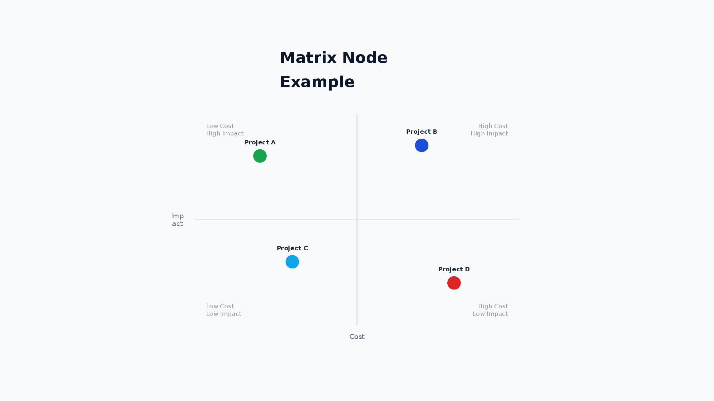

```xml
<Matrix w="600" h="500">
  <MatrixAxes x="Cost" y="Effect" />
  <MatrixQuadrants topLeft="Quick Wins" topRight="Strategic" bottomLeft="Low Priority" bottomRight="Avoid" />
  <MatrixItem label="Initiative A" x="0.2" y="0.8" color="4CAF50" />
  <MatrixItem label="Initiative B" x="0.7" y="0.6" />
</Matrix>
```

- Coordinates: (0,0)=bottom-left, (1,1)=top-right (mathematical coordinate system)
- `<MatrixAxes>`: `x` `y` (axis labels, required)
- `<MatrixQuadrants>`: `topLeft` `topRight` `bottomLeft` `bottomRight`
- `<MatrixItem>`: `label` `x` `y` (required) `color`

**Usage Examples:**

```xml
<!-- Cost-Effectiveness Matrix -->
<Matrix w="600" h="500">
  <MatrixAxes x="Cost" y="Effect" />
  <MatrixQuadrants
    topLeft="Low Cost / High Effect (Priority)"
    topRight="High Cost / High Effect (Consider)"
    bottomLeft="Low Cost / Low Effect (Low Priority)"
    bottomRight="High Cost / Low Effect (Avoid)" />
  <MatrixItem label="Initiative A" x="0.2" y="0.8" color="4CAF50" />
  <MatrixItem label="Initiative B" x="0.7" y="0.6" color="2196F3" />
  <MatrixItem label="Initiative C" x="0.3" y="0.3" color="FF9800" />
  <MatrixItem label="Initiative D" x="0.8" y="0.2" color="E91E63" />
</Matrix>

<!-- Simple Impact-Effort Matrix (without quadrant labels) -->
<Matrix w="500" h="400">
  <MatrixAxes x="Effort" y="Impact" />
  <MatrixItem label="Quick Win" x="0.15" y="0.85" />
  <MatrixItem label="Major Project" x="0.75" y="0.75" />
  <MatrixItem label="Fill-In" x="0.25" y="0.25" />
  <MatrixItem label="Time Sink" x="0.85" y="0.15" />
</Matrix>
```

### 12. Tree

A node for creating tree structures such as organization charts, decision trees, and hierarchical diagrams.

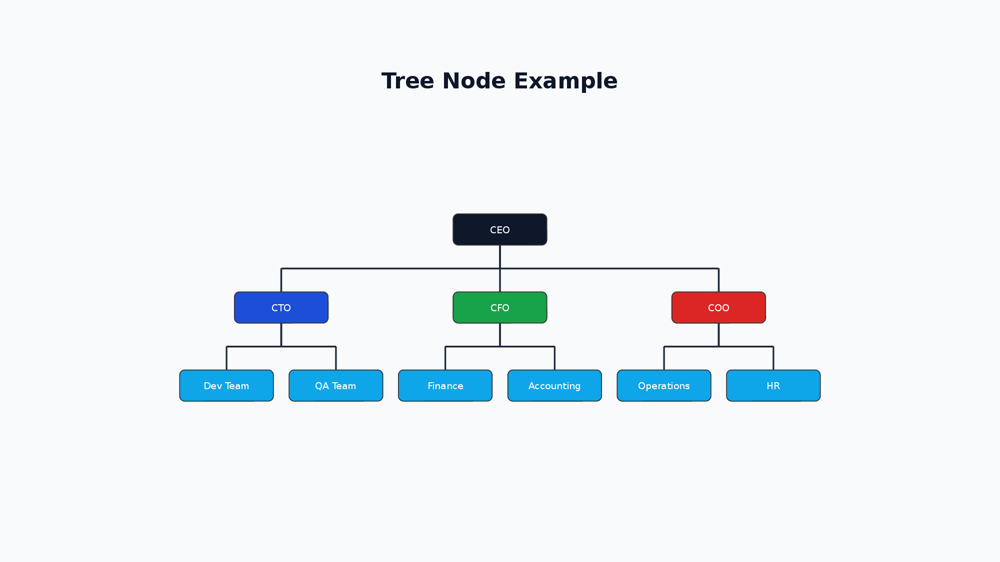

```xml
<Tree layout="vertical" nodeShape="roundRect" w="600" h="400">
  <TreeItem label="CEO" color="1D4ED8">
    <TreeItem label="CTO" color="0EA5E9">
      <TreeItem label="Engineer A" />
    </TreeItem>
    <TreeItem label="CFO" color="16A34A" />
  </TreeItem>
</Tree>
```

| Attribute        | Values                                                |
| ---------------- | ----------------------------------------------------- |
| `layout`         | `vertical` / `horizontal`                             |
| `nodeShape`      | `rect` / `roundRect` / `ellipse`                      |
| `nodeWidth`      | number (default: 120)                                 |
| `nodeHeight`     | number (default: 40)                                  |
| `levelGap`       | number (default: 60)                                  |
| `siblingGap`     | number (default: 20)                                  |
| `connectorStyle` | `connectorStyle.color="333" connectorStyle.width="2"` |

`<TreeItem>` can be nested recursively. The root must have exactly one `<TreeItem>`.

**Usage Examples:**

```xml
<!-- Vertical Organization Chart -->
<Tree layout="vertical" nodeShape="roundRect" w="600" h="400"
  connectorStyle.color="333333" connectorStyle.width="2">
  <TreeItem label="CEO" color="1D4ED8">
    <TreeItem label="CTO" color="0EA5E9">
      <TreeItem label="Engineer A" />
      <TreeItem label="Engineer B" />
    </TreeItem>
    <TreeItem label="CFO" color="16A34A">
      <TreeItem label="Accountant" />
    </TreeItem>
  </TreeItem>
</Tree>

<!-- Horizontal Decision Tree -->
<Tree layout="horizontal" nodeShape="rect" w="600" h="300">
  <TreeItem label="Start">
    <TreeItem label="Option A">
      <TreeItem label="Result 1" />
      <TreeItem label="Result 2" />
    </TreeItem>
    <TreeItem label="Option B">
      <TreeItem label="Result 3" />
    </TreeItem>
  </TreeItem>
</Tree>
```

### 13. Flow

A node for creating flowcharts. Supports various node shapes and automatic layout.

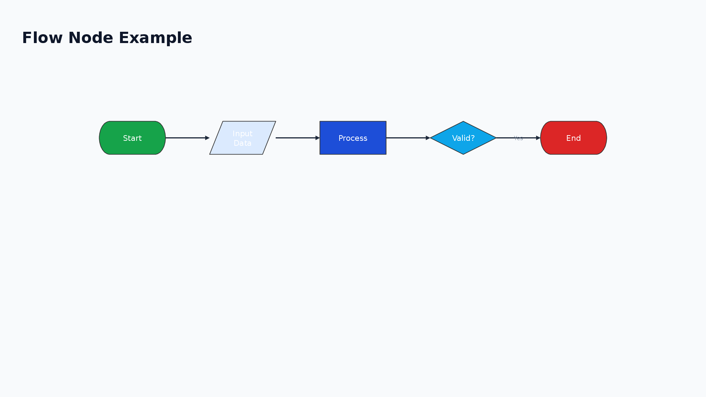

```xml
<Flow direction="horizontal" w="500" h="300">
  <FlowNode id="start" shape="flowChartTerminator" text="Start" color="4CAF50" />
  <FlowNode id="process" shape="flowChartProcess" text="Process" />
  <FlowNode id="decision" shape="flowChartDecision" text="OK?" color="FF9800" />
  <FlowNode id="end" shape="flowChartTerminator" text="End" color="E91E63" />
  <FlowConnection from="start" to="process" />
  <FlowConnection from="process" to="decision" />
  <FlowConnection from="decision" to="end" label="Yes" />
</Flow>
```

| Attribute        | Values                                                                                 |
| ---------------- | -------------------------------------------------------------------------------------- |
| `direction`      | `horizontal` / `vertical`                                                              |
| `nodeWidth`      | number (default: 120)                                                                  |
| `nodeHeight`     | number (default: 60)                                                                   |
| `nodeGap`        | number (default: 80)                                                                   |
| `connectorStyle` | `connectorStyle.color="hex" connectorStyle.width="2" connectorStyle.arrowType="arrow"` |

`<FlowNode>` attributes:

| Attribute   | Values                                                                                                                                                                                                                                                                                            |
| ----------- | ------------------------------------------------------------------------------------------------------------------------------------------------------------------------------------------------------------------------------------------------------------------------------------------------- |
| `id`        | string (required) — unique node identifier                                                                                                                                                                                                                                                        |
| `shape`     | `flowChartTerminator` / `flowChartProcess` / `flowChartDecision` / `flowChartInputOutput` / `flowChartDocument` / `flowChartPredefinedProcess` / `flowChartConnector` / `flowChartPreparation` / `flowChartManualInput` / `flowChartManualOperation` / `flowChartDelay` / `flowChartMagneticDisk` |
| `text`      | string (required) — display text                                                                                                                                                                                                                                                                  |
| `color`     | hex color (e.g. `"4CAF50"`) — node fill color                                                                                                                                                                                                                                                     |
| `textColor` | hex color (e.g. `"FFFFFF"`) — text color                                                                                                                                                                                                                                                          |
| `width`     | number — individual node width (overrides `nodeWidth`)                                                                                                                                                                                                                                            |
| `height`    | number — individual node height (overrides `nodeHeight`)                                                                                                                                                                                                                                          |

`<FlowConnection>`: `from` `to` (required) `label` `color`

**Usage Examples:**

```xml
<!-- Simple vertical flowchart -->
<Flow direction="vertical" w="400" h="300">
  <FlowNode id="start" shape="flowChartTerminator" text="Start" color="4CAF50" />
  <FlowNode id="process" shape="flowChartProcess" text="Process" />
  <FlowNode id="decision" shape="flowChartDecision" text="OK?" color="FF9800" />
  <FlowNode id="end" shape="flowChartTerminator" text="End" color="E91E63" />
  <FlowConnection from="start" to="process" />
  <FlowConnection from="process" to="decision" />
  <FlowConnection from="decision" to="end" label="Yes" />
</Flow>

<!-- Horizontal flowchart -->
<Flow direction="horizontal" w="600" h="200">
  <FlowNode id="input" shape="flowChartInputOutput" text="Input" />
  <FlowNode id="validate" shape="flowChartProcess" text="Validate" />
  <FlowNode id="save" shape="flowChartProcess" text="Save" />
  <FlowNode id="output" shape="flowChartInputOutput" text="Output" />
  <FlowConnection from="input" to="validate" />
  <FlowConnection from="validate" to="save" />
  <FlowConnection from="save" to="output" />
</Flow>
```

### 14. ProcessArrow

A node for creating chevron-style process diagrams. Commonly used for visualizing sequential steps in a workflow.

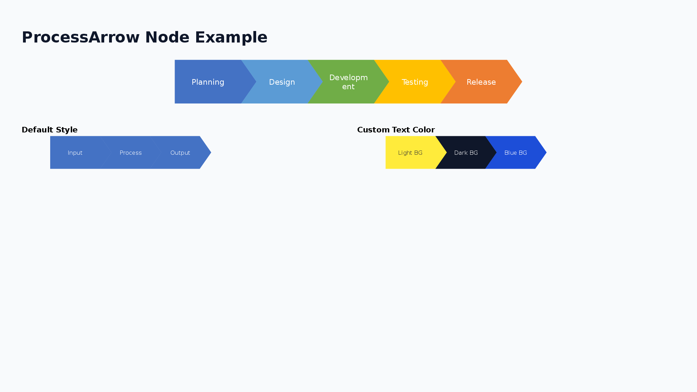

```xml
<ProcessArrow direction="horizontal" w="1000" h="80">
  <ProcessArrowStep label="Planning" color="4472C4" />
  <ProcessArrowStep label="Design" color="5B9BD5" />
  <ProcessArrowStep label="Development" color="70AD47" />
  <ProcessArrowStep label="Release" color="ED7D31" />
</ProcessArrow>
```

| Attribute                | Values                                                     |
| ------------------------ | ---------------------------------------------------------- |
| `direction`              | `horizontal` / `vertical`                                  |
| `itemWidth`              | number (default: 150)                                      |
| `itemHeight`             | number (default: 80)                                       |
| `gap`                    | number (default: -(itemHeight×0.35), negative for overlap) |
| `fontSize`               | number (default: 14)                                       |
| `bold` `italic` `strike` | boolean                                                    |
| `underline`              | `true` / `underline.style="wavy" underline.color="FF0000"` |
| `highlight`              | hex (highlight color)                                      |

`<ProcessArrowStep>`: `label` (required) `color` (default: `4472C4`) `textColor` (default: `FFFFFF`)

**Usage Examples:**

```xml
<!-- Horizontal process arrow with colors -->
<ProcessArrow direction="horizontal" w="1000" h="80">
  <ProcessArrowStep label="Planning" color="4472C4" />
  <ProcessArrowStep label="Design" color="5B9BD5" />
  <ProcessArrowStep label="Development" color="70AD47" />
  <ProcessArrowStep label="Testing" color="FFC000" />
  <ProcessArrowStep label="Release" color="ED7D31" />
</ProcessArrow>

<!-- Vertical process arrow -->
<ProcessArrow direction="vertical" w="200" h="250">
  <ProcessArrowStep label="Phase 1" color="4CAF50" />
  <ProcessArrowStep label="Phase 2" color="2196F3" />
  <ProcessArrowStep label="Phase 3" color="9C27B0" />
</ProcessArrow>

<!-- Custom styling -->
<ProcessArrow direction="horizontal" w="600" h="80"
  itemWidth="180" itemHeight="70" fontSize="16" bold="true">
  <ProcessArrowStep label="Input" color="2196F3" />
  <ProcessArrowStep label="Process" color="00BCD4" />
  <ProcessArrowStep label="Output" color="009688" />
</ProcessArrow>
```

### 15. Pyramid

A node for creating pyramid diagrams. Used for visualizing hierarchies, priorities, and layered concepts like Maslow's hierarchy.

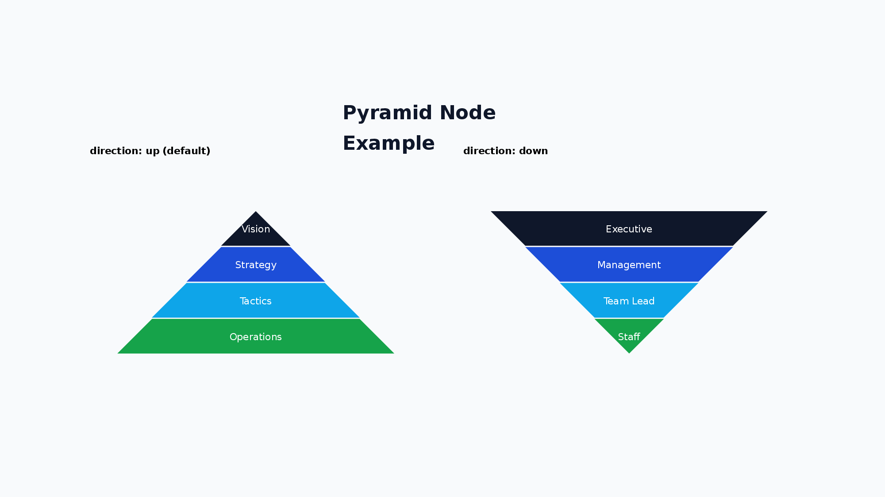

```xml
<Pyramid direction="up" w="600" h="300">
  <PyramidLevel label="Strategy" color="E91E63" />
  <PyramidLevel label="Tactics" color="9C27B0" />
  <PyramidLevel label="Execution" color="673AB7" />
</Pyramid>
```

| Attribute   | Values                  |
| ----------- | ----------------------- |
| `direction` | `up` (default) / `down` |
| `fontSize`  | number (default: 14)    |
| `bold`      | boolean                 |

`<PyramidLevel>`: `label` (required) `color` (default: `4472C4`) `textColor` (default: `FFFFFF`)

- `direction="up"`: First level is the top (narrowest), last level is the base (widest).
- `direction="down"`: First level is the top (widest), last level is the bottom (narrowest).

**Usage Examples:**

```xml
<!-- Basic pyramid (up direction) -->
<Pyramid direction="up" w="600" h="300">
  <PyramidLevel label="Vision" color="1D4ED8" />
  <PyramidLevel label="Strategy" color="2563EB" />
  <PyramidLevel label="Operations" color="3B82F6" />
</Pyramid>

<!-- Inverted pyramid -->
<Pyramid direction="down" w="600" h="300">
  <PyramidLevel label="Wide" color="4472C4" />
  <PyramidLevel label="Medium" color="5B9BD5" />
  <PyramidLevel label="Narrow" color="70AD47" />
</Pyramid>

<!-- Maslow's hierarchy with custom text colors -->
<Pyramid direction="up" w="800" h="400" fontSize="16" bold="true">
  <PyramidLevel label="Self-actualization" color="F44336" textColor="FFFFFF" />
  <PyramidLevel label="Esteem" color="FF9800" textColor="333333" />
  <PyramidLevel label="Love/Belonging" color="FFEB3B" textColor="333333" />
  <PyramidLevel label="Safety" color="4CAF50" textColor="FFFFFF" />
  <PyramidLevel label="Physiological" color="2196F3" textColor="FFFFFF" />
</Pyramid>
```

### 16. Line

A node for drawing lines and arrows. Uses absolute coordinates (x1, y1, x2, y2) for start and end points.

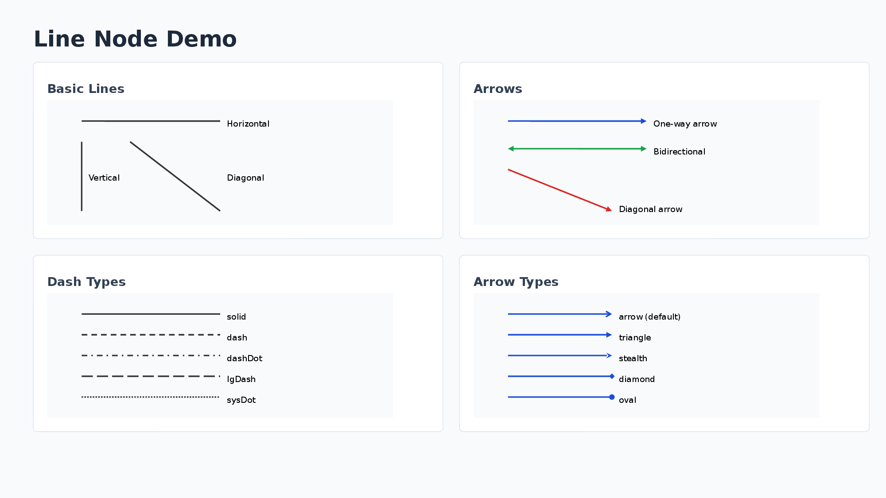

```xml
<Line x1="100" y1="100" x2="300" y2="100" color="333333" lineWidth="2" endArrow="true" />
```

| Attribute                 | Values                                                                               |
| ------------------------- | ------------------------------------------------------------------------------------ |
| `x1` `y1` `x2` `y2`       | number (absolute coordinates, required)                                              |
| `color`                   | hex (default: `000000`)                                                              |
| `lineWidth`               | number (default: 1)                                                                  |
| `dashType`                | `solid` / `dash` / `dashDot` / `lgDash` / `sysDash` etc.                             |
| `beginArrow` / `endArrow` | `true` / `endArrow.type="triangle"` (type: none/arrow/triangle/diamond/oval/stealth) |

Note: Line nodes use absolute coordinates on the slide and are not affected by Yoga layout calculations.

**Usage Examples:**

```xml
<!-- Simple horizontal line -->
<Line x1="100" y1="100" x2="300" y2="100" color="333333" lineWidth="2" />

<!-- Arrow pointing right -->
<Line x1="100" y1="150" x2="300" y2="150" color="333333" lineWidth="2" endArrow="true" />

<!-- Bidirectional arrow -->
<Line x1="100" y1="200" x2="300" y2="200" color="333333" lineWidth="2" beginArrow="true" endArrow="true" />

<!-- Diagonal line with arrow (bottom-right direction) -->
<Line x1="100" y1="100" x2="250" y2="200" color="1D4ED8" lineWidth="2" endArrow="true" />

<!-- Dashed line -->
<Line x1="100" y1="250" x2="300" y2="250" color="333333" lineWidth="2" dashType="dash" />

<!-- Custom arrow type (diamond) -->
<Line x1="100" y1="300" x2="300" y2="300" color="1D4ED8" lineWidth="2" endArrow.type="diamond" />
```

### 17. Layer

A container for absolute positioning of child elements. Child elements are positioned using `x` and `y` coordinates relative to the layer's top-left corner.

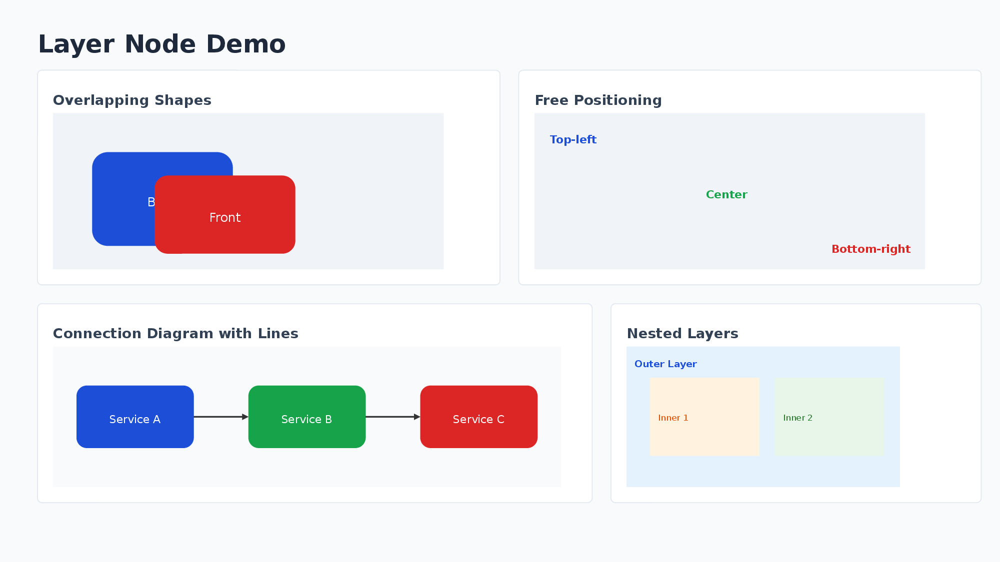

```xml
<Layer w="600" h="400">
  <Shape shapeType="roundRect" x="50" y="50" w="120" h="80" fill.color="1D4ED8" text="A" color="FFFFFF" />
  <Line x1="170" y1="90" x2="300" y2="90" endArrow="true" />
</Layer>
```

- Child elements can have `x` `y` attributes (relative to layer's top-left corner, defaults to `0`).
- Drawing order follows document order (later elements are drawn on top).
- Layer itself participates in Flexbox layout (can be placed in VStack/HStack).
- Layers can be nested.

**Usage Examples:**

```xml
<!-- Basic absolute positioning with overlapping shapes -->
<Layer w="600" h="400" backgroundColor="F0F4F8">
  <!-- Back shape (drawn first) -->
  <Shape shapeType="rect" x="50" y="50" w="120" h="100" fill.color="1D4ED8" text="Back" color="FFFFFF" />
  <!-- Front shape (drawn on top) -->
  <Shape shapeType="rect" x="100" y="80" w="120" h="100" fill.color="DC2626" text="Front" color="FFFFFF" />
</Layer>

<!-- Layer with VStack children for free-form layout -->
<Layer w="800" h="300" backgroundColor="F8FAFC">
  <VStack x="20" y="20" w="200" gap="8" padding="12" backgroundColor="FFFFFF">
    <Text fontSize="14" bold="true">Left Column</Text>
    <Text fontSize="12">Content A</Text>
  </VStack>
  <VStack x="300" y="20" w="200" gap="8" padding="12" backgroundColor="FFFFFF">
    <Text fontSize="14" bold="true">Right Column</Text>
    <Text fontSize="12">Content B</Text>
  </VStack>
</Layer>

<!-- Connection diagram with lines -->
<Layer w="800" h="200" backgroundColor="F8FAFC">
  <Shape shapeType="roundRect" x="50" y="60" w="150" h="80" fill.color="1D4ED8" text="Service A" color="FFFFFF" />
  <Shape shapeType="roundRect" x="350" y="60" w="150" h="80" fill.color="16A34A" text="Service B" color="FFFFFF" />
  <Line x1="200" y1="100" x2="350" y2="100" color="333333" lineWidth="2" endArrow="true" />
  <Text x="240" y="70" fontSize="10">API Call</Text>
</Layer>

<!-- Nested layers -->
<Layer w="600" h="150" backgroundColor="E3F2FD">
  <Text x="10" y="10" fontSize="12" bold="true">Outer Layer</Text>
  <Layer x="50" y="40" w="200" h="80" backgroundColor="FFF3E0">
    <Text x="10" y="30" fontSize="11">Inner Layer</Text>
  </Layer>
</Layer>
```

### 18. Icon

A node for displaying icons from the Lucide icon library. Icons are rendered as PNG images at the specified size and color.

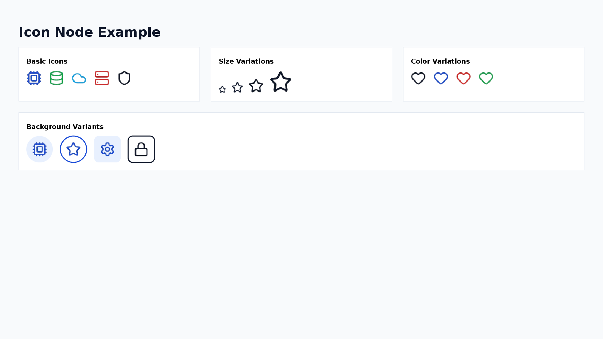

```xml
<Icon name="cpu" size="32" color="#1D4ED8" />
<Icon name="cpu" variant="circle-filled" bgColor="#E8F0FE" color="#1D4ED8" />
```

| Attribute | Values                                                                      |
| --------- | --------------------------------------------------------------------------- |
| `name`    | icon name (required)                                                        |
| `size`    | number (default: 24, in px)                                                 |
| `color`   | hex color (default: `#000000`)                                              |
| `variant` | `circle-filled`, `circle-outlined`, `square-filled`, `square-outlined`      |
| `bgColor` | hex color for the background shape (default: `#E0E0E0` when variant is set) |

All [Lucide icons](https://lucide.dev/icons/) are available. Below are common examples:

**Common Icons (49):**

| Category      | Icons                                                                          |
| ------------- | ------------------------------------------------------------------------------ |
| Technology    | `cpu`, `database`, `cloud`, `server`, `code`, `terminal`, `wifi`, `globe`      |
| People        | `user`, `users`, `contact`                                                     |
| Business      | `briefcase`, `building`, `bar-chart`, `line-chart`, `pie-chart`, `trending-up` |
| Communication | `mail`, `message-square`, `phone`, `video`                                     |
| Action        | `search`, `settings`, `filter`, `download`, `upload`, `share`                  |
| Status        | `check`, `alert-triangle`, `info`, `shield`, `lock`, `unlock`                  |
| Content       | `file`, `folder`, `image`, `calendar`, `clock`, `bookmark`                     |
| Navigation    | `arrow-right`, `arrow-left`, `arrow-up`, `arrow-down`, `external-link`         |
| Other         | `star`, `heart`, `zap`, `target`, `lightbulb`                                  |

### 19. Svg

A node for rendering inline SVG graphics. SVGs are rasterized to PNG at the specified size.

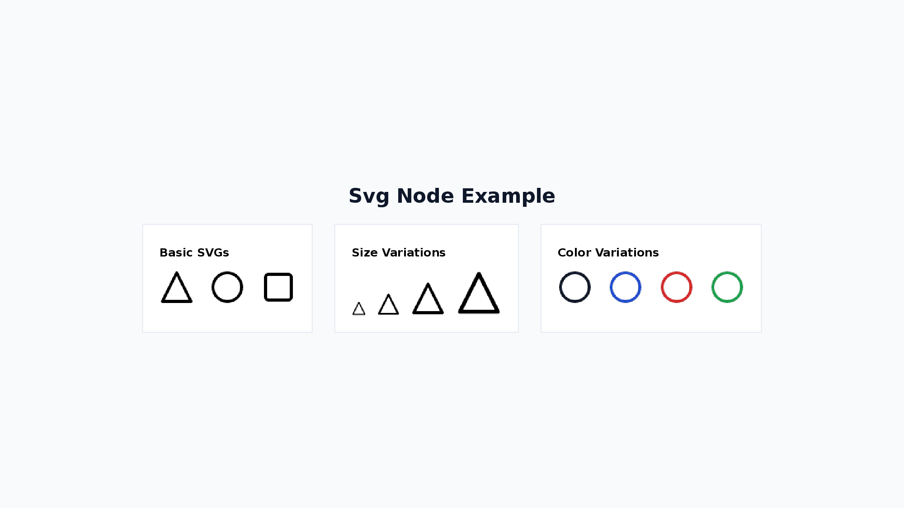

```xml
<Svg w="32" h="32" color="#1D4ED8">
  <svg viewBox="0 0 24 24">
    <path d="M12 2L2 22h20z" fill="none" stroke-width="2"/>
  </svg>
</Svg>
```

| Attribute | Values                             |
| --------- | ---------------------------------- |
| `w`       | number (default: 24, width in px)  |
| `h`       | number (default: 24, height in px) |
| `color`   | hex color                          |

A `<svg>` child element is required.

When `color` is specified, it sets `stroke` and `fill="none"` on the root `<svg>` element. If child elements within the SVG have explicit `stroke` or `fill` attributes, those take precedence over the root-level values.
